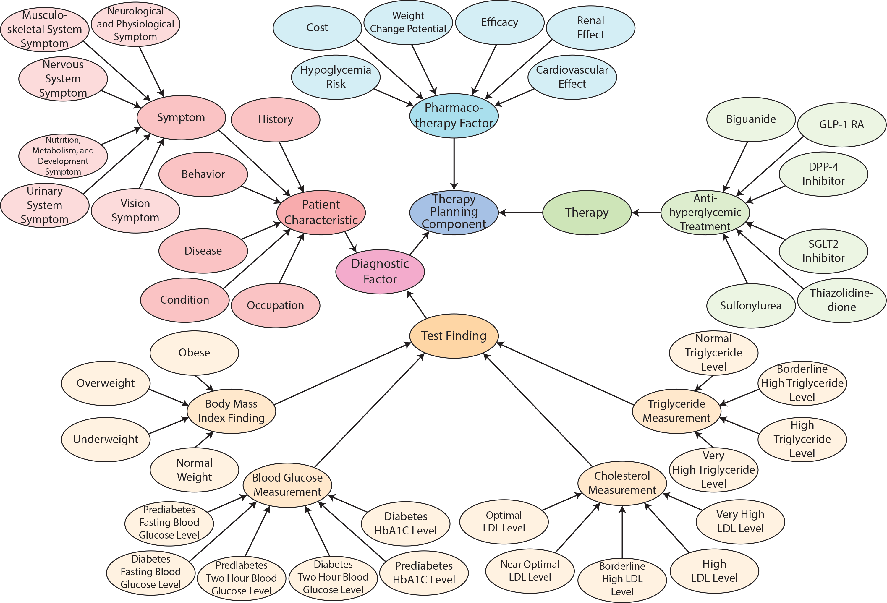
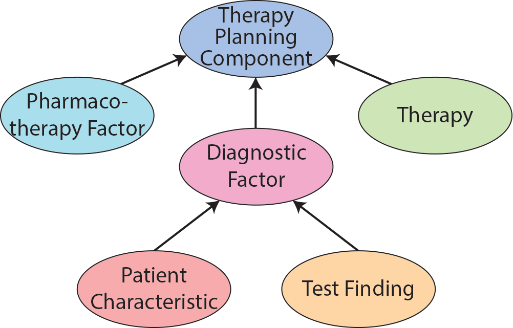
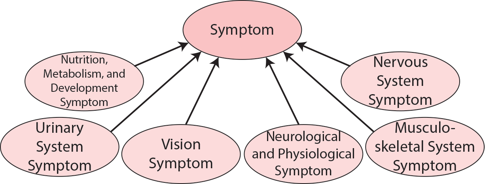
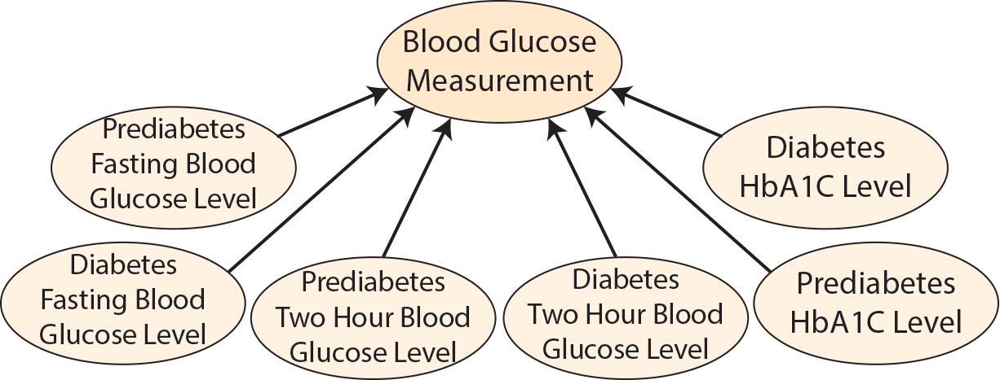
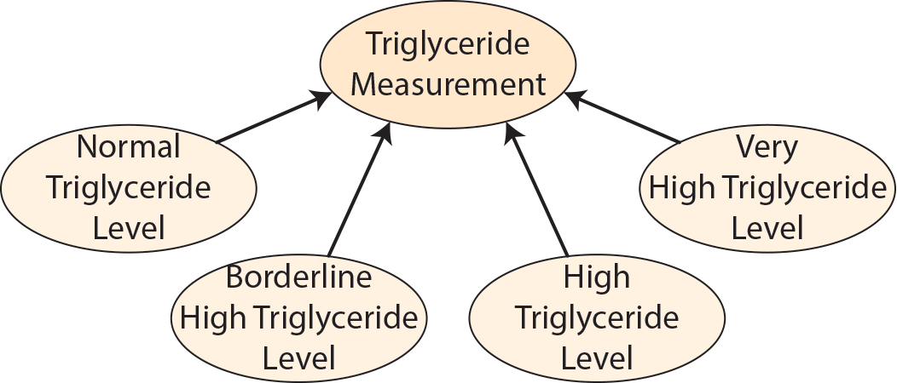
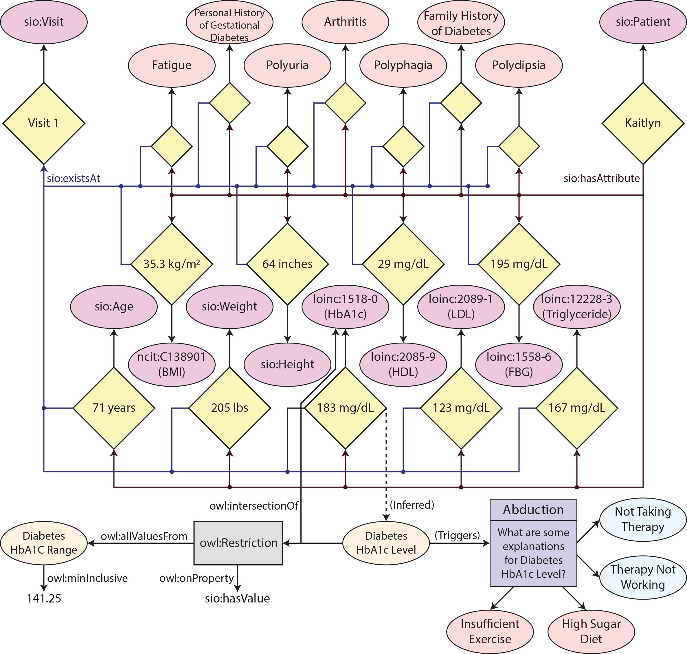

# Overview

The Diabetes Pharmacology Ontology was designed by leveraging the American Diabetes Association 2022 Guidelines Chapter 9 - Pharmacologic Approaches to Glycemic Treatment to represent some common diabetes treatments and several of their characteristics that play a role in therapy planning. Additionally, common symptoms associated with diabetes and lab measurement types were included in the ontology based on NetCE case studies related to diabetes.

# Table of Contents
- [Overview](#overview)
- [Table of Contents](#table-of-contents)
- [Namespaces](#namespaces)
- [Diabetes Pharmacology Ontology](#diabetes-pharmacology-ontology)
  * [Therapy Planning Component](#therapy-planning-component)
  * [Pharmacotherapy Factor](#pharmacotherapy-factor)
    + [Efficacy](#efficacy)
      - [High Efficacy](#high-efficacy)
      - [Intermediate Efficacy](#intermediate-efficacy)
      - [Low Efficacy](#low-efficacy)
    + [Weight Change Potential](#weight-change-potential)
      - [Weight Loss Potential](#weight-loss-potential)
      - [Weight Gain Potential](#weight-gain-potential)
      - [Neutral Weight Change](#neutral-weight-change)
    + [Hypoglycemia Risk](#hypoglycemia-risk)
      - [No Known Hypoglycemia Risk](#no-known-hypoglycemia-risk)
      - [Known Hypoglycemia Risk](#known-hypoglycemia-risk)
    + [Cardiovascular Effect](#cardiovascular-effect)
      - [Atherosclerotic Cardiovascular Disease Risk](#atherosclerotic-cardiovascular-disease-risk)
        * [Potential ASCVD Benefit](#potential-ascvd-benefit)
        * [Increased ASCVD Risk](#increased-ascvd-risk)
        * [Neutral ASCVD Risk](#neutral-ascvd-risk)
      - [Heart Failure Risk](#heart-failure-risk)
        * [Potential Heart Failure Benefit](#potential-heart-failure-benefit)
        * [Increased Heart Failure Risk](#increased-heart-failure-risk)
        * [Neutral Heart Failure Risk](#neutral-heart-failure-risk)
    + [Cost](#cost)
      - [Low Cost](#low-cost)
      - [High Cost](#high-cost)
    + [Renal Effect](#renal-effect)
      - [Diabetic Kidney Disease Progression](#diabetic-kidney-disease-progression)
        * [Potential Diabetic Kidney Disease Benefit](#potential-diabetic-kidney-disease-benefit)
        * [Increased Diabetic Kidney Disease Risk](#increased-diabetic-kidney-disease-risk)
        * [Neutral Diabetic Kidney Disease Risk](#neutral-diabetic-kidney-disease-risk)
      - [Renal Dosing Consideration](#renal-dosing-consideration)
  * [Diagnostic Factor](#diagnostic-factor)
    + [Symptom](#symptom)
      - [Nutrition Metabolism and Development Symptom](#nutrition-metabolism-and-development-symptom)
        * [Polydipsia](#polydipsia)
        * [Polyphagia](#polyphagia)
      - [Urinary System Symptom](#urinary-system-symptom)
        * [Polyuria](#polyuria)
        * [Dysuria](#dysuria)
        * [Urinary Tract Infection](#urinary-tract-infection)
        * [Frequent Urination](#frequent-urination)
        * [Foul Urine](#foul-urine)
      - [Vision Symptom](#vision-symptom)
        * [Blurred Vision](#blurred-vision)
      - [Neurological and Physiological Symptom](#neurological-and-physiological-symptom)
        * [Fatigue](#fatigue)
      - [Musculoskeletal System Symptom](#musculoskeletal-system-symptom)
        * [Arthritis](#arthritis)
        * [Peripheral Neuropathy](#peripheral-neuropathy)
      - [Nervous System Symptom](#nervous-system-symptom)
        * [Cerebral Vascular Accident](#cerebral-vascular-accident)
        * [Pain](#pain)
          + [Chest Pain](#chest-pain)
        * [Bilateral Lower Extremity Burning Sensation](#bilateral-lower-extremity-burning-sensation)
    + [Condition](#condition)
      - [Hyperlipidemia](#hyperlipidemia)
      - [Hypertension](#hypertension)
    + [Disease](#disease)
      - [Coronary Artery Disease](#coronary-artery-disease)
      - [Diabetes Mellitus](#diabetes-mellitus)
      - [Renal Disease](#renal-disease)
      - [Cardiovascular Disease](#cardiovascular-disease)
    + [Behavior](#behavior)
      - [Sedentary Lifestyle](#sedentary-lifestyle)
      - [Alcohol Use](#alcohol-use)
      - [Drug Use](#drug-use)
    + [Occupation](#occupation)
      - [Sedentary Occupation](#sedentary-occupation)
    + [History](#history)
      - [Family History](#family-history)
        * [Family History of Coronary Artery Disease](#family-history-of-coronary-artery-disease)
        * [Family History of Diabetes](#family-history-of-diabetes)
      - [Personal History](#personal-history)
        * [Personal History of Gestational Diabetes](#personal-history-of-gestational-diabetes)
        * [Personal History of Febrile States](#personal-history-of-febrile-states)
  * [Therapy](#therapy)
    + [Antihyperglycemic Treatment](#antihyperglycemic-treatment)
      - [Biguanide](#biguanide)
        * [Metformin](#metformin)
      - [SGLT2 Inhibitor](#sglt2-inhibitor)
        * [Empagliflozin](#empagliflozin)
        * [Canagliflozin](#canagliflozin)
        * [Dapagliflozin](#dapagliflozin)
        * [Ertugliflozin](#ertugliflozin)
      - [GLP-1 RA](#glp-1-ra)
        * [Dulaglutide](#dulaglutide)
        * [Liraglutide](#liraglutide)
        * [Semaglutide](#semaglutide)
        * [Lixisenatide](#lixisenatide)
        * [Exenatide](#exenatide)
      - [DPP-4 Inhibitor](#dpp-4-inhibitor)
        * [Sitagliptin](#sitagliptin)
        * [Saxagliptin](#saxagliptin)
        * [Alogliptin](#alogliptin)
        * [Linagliptin](#linagliptin)
      - [Thiazolidinedione](#thiazolidinedione)
        * [Pioglitazone](#pioglitazone)
        * [Rosiglitazone](#rosiglitazone)
      - [Sulfonylurea](#sulfonylurea)
        * [Glyburide](#glyburide)
        * [Glipizide](#glipizide)
        * [Glimepiride](#glimepiride)
  * [Measurement](#measurement)
    + [Body Mass Index Finding](#body-mass-index-finding)
      - [Underweight](#underweight)
      - [Normal Weight](#normal-weight)
      - [Overweight](#overweight)
      - [Obese](#obese)
    + [Blood Glucose Measurement](#blood-glucose-measurement)
      - [Prediabetes Fasting Blood Glucose Level](#prediabetes-fasting-blood-glucose-level)
      - [Diabetes Fasting Blood Glucose Level](#diabetes-fasting-blood-glucose-level)
      - [Prediabetes Two Hour Blood Glucose Level](#prediabetes-two-hour-blood-glucose-level)
      - [Diabetes Two Hour Blood Glucose Level](#diabetes-two-hour-blood-glucose-level)
      - [Prediabetes HbA1C Level](#prediabetes-hba1c-level)
      - [Diabetes HbA1C Level](#diabetes-hba1c-level)
    + [Cholesterol Measurement](#cholesterol-measurement)
      - [Optimal LDL Level](#optimal-ldl-level)
      - [Near Optimal LDL Level](#near-optimal-ldl-level)
      - [Borderline High LDL Level](#borderline-high-ldl-level)
      - [High LDL Level](#high-ldl-level)
      - [Very High LDL Level](#very-high-ldl-level)
    + [Triglyceride Measurement](#triglyceride-measurement)
      - [Normal Triglyceride Level](#normal-triglyceride-level)
      - [Borderline High Triglyceride Level](#borderline-high-triglyceride-level)
      - [High Triglyceride Level](#high-triglyceride-level)
      - [Very High Triglyceride Level](#very-high-triglyceride-level)
- [Personal Health Knowledge Graph](#personal-health-knowledge-graph)
- [Supplementary Material](#supplementary-material)
  * [Evaluation against Principles for Developing Computational Biomedical Knowledge](#evaluation-against-principles-for-developing-computational-biomedical-knowledge)
    + [Adherence to the FAIR Principles](#adherence-to-the-fair-principles)
      - [Findability and Accessibility](#findability-and-accessibility)
      - [Interoperability](#interoperability)
      - [Reusability](#reusability)
    + [Trustworthiness](#trustworthiness)
      - [Knowledge](#knowledge)
      - [Evolution](#evolution)
      - [Publication](#publication)
    + [Openness](#openness)
  * [Drug-Specific and Patient Factors to Consider When Selecting Antihyperglycemic Treatment in Adults With Type 2 Diabetes](#drug-specific-and-patient-factors-to-consider-when-selecting-antihyperglycemic-treatment-in-adults-with-type-2-diabetes)
  * [Pharmacologic Treatment of Hyperglycemia in Adults With Type 2 Diabetes](#pharmacologic-treatment-of-hyperglycemia-in-adults-with-type-2-diabetes)

# Namespaces

The namespaces used in DPO are listed below.

##### DPO Namespaces

| Prefix | URI |
|:-------------|:------------------|
| dpo | [http://purl.org/twc/dpo/ont/](http://purl.org/twc/dpo/ont/) |
| dpo-kb | [http://purl.org/twc/dpo/kb/](http://purl.org/twc/dpo/kb/) |
| owl | [http://www.w3.org/2002/07/owl#](http://www.w3.org/2002/07/owl#) |
| rdf | [http://www.w3.org/1999/02/22-rdf-syntax-ns#](http://www.w3.org/1999/02/22-rdf-syntax-ns#) |
| rdfs | [http://www.w3.org/2000/01/rdf-schema#](http://www.w3.org/2000/01/rdf-schema#) |
| xsd | [http://www.w3.org/2001/XMLSchema#](http://www.w3.org/2001/XMLSchema#) |
| dct | [http://purl.org/dc/terms/](http://purl.org/dc/terms/) |
| skos | [http://www.w3.org/2004/02/skos/core#](http://www.w3.org/2004/02/skos/core#) |
| ncit | [http://purl.obolibrary.org/obo/NCIT_](http://purl.obolibrary.org/obo/NCIT_) |
| loinc | [http://purl.bioontology.org/ontology/LNC/](http://purl.bioontology.org/ontology/LNC/) |
| chebi | [http://purl.obolibrary.org/obo/CHEBI_](http://purl.obolibrary.org/obo/CHEBI_) |
| efo | [http://www.ebi.ac.uk/efo/EFO_>](http://www.ebi.ac.uk/efo/EFO_>) |
| symp | [http://purl.obolibrary.org/obo/SYMP_](http://purl.obolibrary.org/obo/SYMP_) |
| hp | [http://purl.obolibrary.org/obo/HP_](http://purl.obolibrary.org/obo/HP_) |
| sio | [http://semanticscience.org/resource/](http://semanticscience.org/resource/) |


# Diabetes Pharmacology Ontology

The Diabetes Pharmacology Ontology is an ontology designed to aid in clinical decision making tasks related to type 2 diabetes. Included in the ontology are pharmacotherapy and diagnostic factors, antiglycemic therapies, and diabetes associated categorizations of measurements.



The diagram above shows the concepts in the ontology that extend from the root concept, **dpo:Factor**, up to 3 hops from the root. While all the classes in the ontology are not included in this diagram, the complete set of concepts are described in this document below.

## Therapy Planning Component
> 

The root branch of the Diabetes Pharmacology Ontology is **dpo:TherapyPlanningComponent**.

```
dpo:TherapyPlanningComponent rdf:type owl:Class ;
    rdfs:label "Therapy Planning Component" ;
    rdfs:comment ""^^xsd:string ;
    skos:definition ""^^xsd:string .
```

Four top level branches extend from **dpo:TherapyPlanningComponent**. These are **dpo:PharmacotherapyFactor**, **dpo:DiagnosticFactor**, and **dpo:Therapy**. **dpo:DiagnosticFactor** is made up of the **dpo:PatientCharacteristic** and **dpo:TestFinding** branches.



All other branches of the ontology extend from these top level concepts.

## Pharmacotherapy Factor
> Therapy-related factors identified include: route of administration, treatment complexity, duration of treatment period, medication side effects, degree of behavioral change required, taste of medication and requirement for drug storage. \[Definition Source: [https://www.ncbi.nlm.nih.gov/pmc/articles/PMC2503662/](https://www.ncbi.nlm.nih.gov/pmc/articles/PMC2503662/)\]

```
dpo:PharmacotherapyFactor rdf:type owl:Class ;
    rdfs:subClassOf dpo:Factor ;
    owl:equivalentClass ncit:C18228 ;
    rdfs:label "Pharmacotherapy Factor" ;
    rdfs:comment "A circumstance influencing the treatment of a disease through the use or recommendation of one or more drugs."^^xsd:string ;
    skos:definition "Therapy-related factors identified include: route of administration, treatment complexity, duration of treatment period, medication side effects, degree of behavioral change required, taste of medication and requirement for drug storage. \[Definition Source: url:https://www.ncbi.nlm.nih.gov/pmc/articles/PMC2503662/\]"^^xsd:string .
```

The Pharmacotherapy Factors included in this ontology are based on those included in Chapter 9 of the ADA guidelines. The subclasses of **dpo:PharmacotherapyFactor** include the top level pharmacotherapy factors **dpo:Efficacy**, **dpo:WeightChangePotential**, **dpo:HypoglycemiaRisk**, **dpo:CardiovascularEffect**, **dpo:Cost**, and **dpo:RenalEffect**.


Potential categorizations of these top level pharmacotherapy factors are encoded as subclasses of each respective pharmacotherapy factor. The recommendation of a therapy may be based on whether or not a patient has an attribute that is of type one of the subclasses of the top level pharmacotherapy factors.

### Efficacy
> The probability of benefit to individuals in a defined population from a medical technology applied for a given medical problem under ideal conditions of use. Efficacy is a measure of effect of therapy among appropriate patients in whom treatment is tolerated and effectively administered, under the condition of sufficient patients' compliance, usually determined in randomized trials. [Definition Source: NCI]

```
dpo:Efficacy rdfs:subClassOf dpo:PharmacotherapyFactor ;
    owl:equivalentClass ncit:C39547 ;
    rdfs:label "Efficacy"^^xsd:string ;
    skos:definition "The probability of benefit to individuals in a defined population from a medical technology applied for a given medical problem under ideal conditions of use. Efficacy is a measure of effect of therapy among appropriate patients in whom treatment is tolerated and effectively administered, under the condition of sufficient patients' compliance, usually determined in randomized trials. [Definition Source: NCI]"^^xsd:string .
```

Subclasses of **dpo:Efficacy** include **dpo:HighEfficacy**, **dpo:IntermediateEfficacy**, and **dpo:LowEfficacy**.

#### High Efficacy
> A high capacity to bring about a desired effect.

```

```

#### Intermediate Efficacy
> An intermediate capacity to bring about a desired effect.

```

```

#### Low Efficacy
> The lack of expected or desired effect related to a therapy. [Definition Source: NCI]

```
dpo:LowEfficacy rdfs:subClassOf dpo:Efficacy ;
    owl:equivalentClass ncit:C48226 ;
    rdfs:label "Low Efficacy"^^xsd:string ;
    rdfs:comment "A low capacity to bring about a desired effect."^^xsd:string ;
    skos:definition "The lack of expected or desired effect related to a therapy. [Definition Source: NCI]"^^xsd:string .
```

### Weight Change Potential
> The capacity for an increase or decrease in the weight of an individual.

```

```

Subclasses of **dpo:WeightChangePotential** include **dpo:WeightLossPotential**, **dpo:WeightGainPotential**, and **dpo:NeutralWeightChange**.

#### Weight Loss Potential
> The capacity for a decrease in the weight of an individual.

```

```

#### Weight Gain Potential
> The capacity for an increase in the weight of an individual.

```

```

#### Neutral Weight Change
> The lack of an effect on the capacity for an increase or decrease in the weight of an individual.

```

```

### Hypoglycemia Risk
> The most important risk factor for the occurrence of hypoglycemia is the aggressiveness of therapy applied to achieve glycemic control. \[Definition Source: [https://www.ncbi.nlm.nih.gov/pmc/articles/PMC3784865/](https://www.ncbi.nlm.nih.gov/pmc/articles/PMC3784865/)\]

```
dpo:HypoglycemiaRisk rdfs:subClassOf dpo:PharmacotherapyFactor ;
    rdfs:label "Hypoglycemia Risk" ;
    rdfs:comment "The possiblility of lowering blood sugar below the normal range."^^xsd:string ;
    skos:definition "The most important risk factor for the occurrence of hypoglycemia is the aggressiveness of therapy applied to achieve glycemic control. [Definition Source: url:https://www.ncbi.nlm.nih.gov/pmc/articles/PMC3784865/ ]"^^xsd:string .
```

Subclasses of **dpo:HypoglycemiaRisk** include **dpo:NoKnownHypoglycemiaRisk** and **dpo:KnownHypoglycemiaRisk**.

#### No Known Hypoglycemia Risk
> No known association with the lowering of blood sugar below the normal range.

```

```

#### Known Hypoglycemia Risk
> A known association with the lowering of blood sugar below the normal range.

```

```

### Cardiovascular Effect
> Cardiovascular effects are defined as any uncomfortable physical effect that relates to the heart and blood vessels. [Definition Source: [https://effectindex.com/categories/cardiovascular-effects](https://effectindex.com/categories/cardiovascular-effects) ]

```
dpo:CardiovascularEffect rdfs:subClassOf dpo:PharmacotherapyFactor ;
    rdfs:label "Cardiovascular Effect" ;
    rdfs:comment "A pharmacotherapy factor related to the heart or blood vessels."^^xsd:string ;
    skos:definition "Cardiovascular effects are defined as any uncomfortable physical effect that relates to the heart and blood vessels. [Definition Source: url:https://effectindex.com/categories/cardiovascular-effects ]"^^xsd:string .
```

**dpo:CardiovascularEffect** contains two main subclasses, **dpo:AtheroscleroticCardiovascularDiseaseRisk** and **dpo:HeartFailureRisk**.

#### Atherosclerotic Cardiovascular Disease Risk
> Risk of cardiovascular disease resulting from atherosclerosis.

```

```

Subclasses of **dpo:AtheroscleroticCardiovascularDiseaseRisk** include **dpo:PotentialASCVDBenefit**, **dpo:IncreasedASCVDRisk**, and **dpo:NeutralASCVDRisk**.

##### Potential ASCVD Benefit
> Potential to reduce the risk of cardiovascular disease resulting from atherosclerosis.

```

```

##### Increased ASCVD Risk
> Potential to increase the risk of cardiovascular disease resulting from atherosclerosis.

```

```

##### Neutral ASCVD Risk
> Minimal effect on reducing or increasing the risk of cardiovascular disease resulting from atherosclerosis.

```

```

#### Heart Failure Risk
> Risk of heart failure.

```

```

Subclasses of **dpo:HeartFailureRisk** include **dpo:PotentialHeartFailureBenefit**, **dpo:IncreasedHeartFailureRisk**, and **dpo:NeutralHeartFailureRisk**.

##### Potential Heart Failure Benefit
> Potential to decrease the risk of heart failure.

```

```

##### Increased Heart Failure Risk
> Potential to increase the risk of heart failure.

```

```

##### Neutral Heart Failure Risk
> Minimal effect on reducing or increasing the risk of heart failure.

```

```

### Cost
> The amount paid, charged, or engaged to be paid, for purchasing goods, services and financial instruments. [Definition Source: NCI]

```
dpo:Cost rdfs:subClassOf dpo:PharmacotherapyFactor ;
    owl:equivalentClass ncit:C69088 ;
    rdfs:label "Cost" ;
    rdfs:comment "The expense associated with a therapy."^^xsd:string ;
    skos:definition "The amount paid, charged, or engaged to be paid, for purchasing goods, services and financial instruments. [Definition Source: NCI]"^^xsd:string .
```

Subclasses of **dpo:Cost** include **dpo:LowCost** and **dpo:HighCost**.

#### Low Cost
> Relatively inexpensive.

```

```

#### High Cost
> Relatively expensive.

```

```

### Renal Effect
> A pharmacotherapy factor related to the kidneys.

```

```

Subclasses of **dpo:RenalEffect** include **dpo:DiabeticKidneyDiseaseProgression** and **dpo:RenalDosingConsideration**.

#### Diabetic Kidney Disease Progression
> Defined by the presence of diabetes and reduced estimated glomerular filtration rate (eGFR) to <60/ mL/min/1.73 m2, increased albuminuria (>300 mg/24 hours) or both, diabetic kidney disease (DKD) is a progressive disease that affects one in seven individuals worldwide eventuating renal replacement therapy (RRT) and premature death secondary to cardiovascular causes. [Definition Source: [https://www.ncbi.nlm.nih.gov/books/NBK571719/](https://www.ncbi.nlm.nih.gov/books/NBK571719/) ]

```
dpo:DiabeticKidneyDiseaseProgression rdfs:subClassOf dpo:RenalEffect;
    rdfs:label "Diabetic Kidney Disease Progression"^^xsd:string ;
    rdfs:comment "The progression of diabetic kidney disease."^^xsd:string ;
    skos:definition "Defined by the presence of diabetes and reduced estimated glomerular filtration rate (eGFR) to <60/ mL/min/1.73 m2, increased albuminuria (>300 mg/24 hours) or both, diabetic kidney disease (DKD) is a progressive disease that affects one in seven individuals worldwide eventuating renal replacement therapy (RRT) and premature death secondary to cardiovascular causes. [Definition Source: url:https://www.ncbi.nlm.nih.gov/books/NBK571719/ ]"^^xsd:string .
```

Subclasses of **dpo:DiabeticKidneyDiseaseProgression** include **dpo:PotentialDKDBenefit**, **dpo:IncreasedDKDRisk**, and **dpo:NeutralDKDRisk**.

##### Potential Diabetic Kidney Disease Benefit
> Potential to decrease the risk or progression of diabetic kidney disease.

```

```

##### Increased Diabetic Kidney Disease Risk
> Potential to increase the risk or progression of diabetic kidney disease.

```

```

##### Neutral Diabetic Kidney Disease Risk
> Minimal effect on reducing or increasing the risk or progression of diabetic kidney disease.

```

```

#### Renal Dosing Consideration
> Drug dosage considerations related to the effect on the kidneys.

```

```

## Diagnostic Factor
> A biological, physiological, behavioral, or molecular indicator of the presence or predisposition towards development of a specific disease. [Definition Source: NCI]

```
dpo:DiagnosticFactor rdf:type owl:Class ;
    rdfs:subClassOf dpo:Factor ;
    owl:equivalentClass ncit:C19591 ;
    rdfs:label "Diagnostic Factor" ;
    rdfs:comment "A circumstance influencing the dianosis of a disease."^^xsd:string ;
    skos:definition "A biological, physiological, behavioral, or molecular indicator of the presence or predisposition towards development of a specific disease. [Definition Source: NCI]"^^xsd:string .
```

Subclasses of **dpo:DiagnosticFactor** include **dpo:PatientCharacteristic** and **dpo:TestFinding**.

## Patient Characteristic
> 

```
```
Subclasses of **dpo:PatientCharacteristic** include **dpo:Symptom**, **dpo:Condition**, **dpo:Disease**, **dpo:Behavior**, **dpo:Occupation**, and **dpo:History**.


Patient characteristics included within the ontology are based on diabetes related NetCE case studies.

### Symptom
> A symptom is a perceived change in function, sensation, loss, disturbance or appearance reported by a patient indicative of a disease. [ [https://link.springer.com/chapter/10.1007/978-1-4615-4789-1_5](https://link.springer.com/chapter/10.1007/978-1-4615-4789-1_5) [https://www.nature.com/subjects/signs-and-symptoms](https://www.nature.com/subjects/signs-and-symptoms) [https://www.merriam-webster.com/dictionary/symptom](https://www.merriam-webster.com/dictionary/symptom) ][Definition Source: SYMP:0000462]

```
dpo:Symptom rdf:type owl:Class ;
    rdfs:subClassOf dpo:DiagnosticFactor ;
    owl:equivalentClass symp:0000462 ;
    rdfs:label "Symptom"^^xsd:string ;
    skos:definition "A symptom is a perceived change in function, sensation, loss, disturbance or appearance reported by a patient indicative of a disease. [ url:https://link.springer.com/chapter/10.1007/978-1-4615-4789-1_5 url:https://www.nature.com/subjects/signs-and-symptoms url:https://www.merriam-webster.com/dictionary/symptom ][Definition Source: SYMP:0000462]"^^xsd:string .
```

Symptoms included in the ontology are based on the symtoms of the example patients in the NetCE diabetes related case studies.

The symtpoms included in the ontology are linked to terms in the Symptoms Ontology using _owl:equivalentClass_.



The top level subclasses of **dpo:Symptom** include **dpo:NutritionMetabolismAndDevelopmentSymptom**, **dpo:UrinarySystemSymptom**, **dpo:VisionSymptom**, **dpo:NeurologicalAndPhysiologicalSymptom**, **dpo:MusculoskeletalSystemSymptom**, and **dpo:NervousSystemSymptom**.

#### Nutrition Metabolism and Development Symptom
> Symptoms concerning nutrition metabolism and development [include:] A disorder characterized by a loss of appetite; An abnormal loss of the appetite for food. Anorexia can be caused by cancer, aids, a mental disorder (i.e., anorexia nervosa), or other diseases; Clinical manifestation consisting of a physiopathological lack or loss of appetite accompanied by an aversion to food and the inability to eat; Loss of appetite; The lack or loss of appetite accompanied by an aversion to food and the inability to eat. It is the defining characteristic of the disorder anorexia nervosa. [Definition Source: url:[http://www.icd9data.com/2013/Volume1/780-799/780-789/783/default.htm](http://www.icd9data.com/2013/Volume1/780-799/780-789/783/default.htm) ]

```
dpo:NutritionMetabolismAndDevelopmentSymptom rdf:type owl:Class ;
    rdfs:subClassOf dpo:Symptom ;
    owl:equivalentClass symp:0000473 ;
    rdfs:label "Nutrition Metabolism and Development Symptom"^^xsd:string ;
    rdfs:comment "A symptom involving the nutrition, metabolism, and/or development system."^^xsd:string ;
    skos:definition "Symptoms concerning nutrition metabolism and development [include:] A disorder characterized by a loss of appetite; An abnormal loss of the appetite for food. Anorexia can be caused by cancer, aids, a mental disorder (i.e., anorexia nervosa), or other diseases; Clinical manifestation consisting of a physiopathological lack or loss of appetite accompanied by an aversion to food and the inability to eat; Loss of appetite; The lack or loss of appetite accompanied by an aversion to food and the inability to eat. It is the defining characteristic of the disorder anorexia nervosa. [Definition Source: url:http://www.icd9data.com/2013/Volume1/780-799/780-789/783/default.htm ]"^^xsd:string .
```

Subclasses of **dpo:NutritionMetabolismAndDevelopmentSymptom** include **dpo:Polydipsia** and **dpo:Polyphagia**.

##### Polydipsia
> Polydipsia is a nutrition, metabolism, and development symptom characterized by an excessive or abnormal thirst. [ [http://www2.merriam-webster.com/cgi-bin/mwmednlm?book=Medical&va=polydipsia](http://www2.merriam-webster.com/cgi-bin/mwmednlm?book=Medical&va=polydipsia) ][Definition Source: SYMP:0000560]

```
dpo:Polydipsia rdf:type owl:Class ;
    rdfs:subClassOf dpo:NutritionMetabolismAndDevelopmentSymptom ;
    owl:equivalentClass symp:0000560 ;
    rdfs:label "Polydipsia"^^xsd:string ;
    skos:definition "Polydipsia is a nutrition, metabolism, and development symptom characterized by an excessive or abnormal thirst. [ url:http://www2.merriam-webster.com/cgi-bin/mwmednlm?book=Medical&va=polydipsia ][Definition Source: SYMP:0000560]"^^xsd:string .
```

##### Polyphagia
> Polyphagia is a nutrition, metabolism, and development symptom characterized by an excessive appetite or eating. [ [http://www2.merriam-webster.com/cgi-bin/mwmednlm?book=Medical&va=polyphagia](http://www2.merriam-webster.com/cgi-bin/mwmednlm?book=Medical&va=polyphagia) ][Definition Source: SYMP:0000524]

```
dpo:Polyphagia rdf:type owl:Class ;
    rdfs:subClassOf dpo:NutritionMetabolismAndDevelopmentSymptom ;
    owl:equivalentClass symp:0000524 ;
    rdfs:label "Polyphagia"^^xsd:string ;
    skos:definition "Polyphagia is a nutrition, metabolism, and development symptom characterized by an excessive appetite or eating. [ url:http://www2.merriam-webster.com/cgi-bin/mwmednlm?book=Medical&va=polyphagia ][Definition Source: SYMP:0000524]"^^xsd:string .
```

#### Urinary System Symptom
> Symptoms of urinary disorders vary from person to person and based on the cause of the disorders. Common urinary symptoms include: Abdominal cramping; Abdominal, pelvic or back pain that can be severe; Bloody or pink-colored urine (hematuria); Cloudy urine; Fever and chills; Foul-smelling urine; Frequent urination; General ill feeling; Leaking of urine; Pain during sexual intercourse; Pain or burning with urination (dysuria); Unexplained weight loss; Urgent need to urinate. [Definition Source: url:[https://www.healthgrades.com/right-care/kidneys-and-the-urinary-system/urinary-disorders](https://www.healthgrades.com/right-care/kidneys-and-the-urinary-system/urinary-disorders) ]

```
dpo:UrinarySystemSymptom rdf:type owl:Class ;
    rdfs:subClassOf dpo:Symptom ;
    owl:equivalentClass symp:0000486 ;
    rdfs:label "Urinary System Symptom"^^xsd:string ;
    rdfs:comment "A symptom involving the urinary system."^^xsd:string ;
    skos:definition "Symptoms of urinary disorders vary from person to person and based on the cause of the disorders. Common urinary symptoms include: Abdominal cramping; Abdominal, pelvic or back pain that can be severe; Bloody or pink-colored urine (hematuria); Cloudy urine; Fever and chills; Foul-smelling urine; Frequent urination; General ill feeling; Leaking of urine; Pain during sexual intercourse; Pain or burning with urination (dysuria); Unexplained weight loss; Urgent need to urinate. [Definition Source: url:https://www.healthgrades.com/right-care/kidneys-and-the-urinary-system/urinary-disorders ]"^^xsd:string .
```

Subclasses of **dpo:UrinarySystemSymptom** include **dpo:Polyuria**, **dpo:Dysuria**, **dpo:UrinaryTractInfection**, **dpo:FrequentUrination**, and **dpo:FoulUrine**.

##### Polyuria
> A urinary system symptom that is characterized by the excessive secretion of urine. [ [http://www2.merriam-webster.com/cgi-bin/mwmednlm?book=Medical&va=polyuria](http://www2.merriam-webster.com/cgi-bin/mwmednlm?book=Medical&va=polyuria) ][Definition Source: SYMP:0000565]

```
dpo:Polyuria rdf:type owl:Class ;
    rdfs:subClassOf dpo:UrinarySystemSymptom ;
    owl:equivalentClass symp:0000565 ;
    rdfs:label "Polyuria"^^xsd:string ;
    skos:definition "A urinary system symptom that is characterized by the excessive secretion of urine. [ url:http://www2.merriam-webster.com/cgi-bin/mwmednlm?book=Medical&va=polyuria ][Definition Source: SYMP:0000565]"^^xsd:string .
```

##### Dysuria
> A urinary system symptom that is characterized by the difficult, or painful, discharge of urine. [ [http://www2.merriam-webster.com/cgi-bin/mwmednlm?book=Medical&va=dysuria](http://www2.merriam-webster.com/cgi-bin/mwmednlm?book=Medical&va=dysuria) ][Definition Source: SYMP:0000485]

```
dpo:Dysuria rdf:type owl:Class ;
    rdfs:subClassOf dpo:UrinarySystemSymptom ;
    owl:equivalentClass symp:0000485 ;
    rdfs:label "Dysuria"^^xsd:string ;
    skos:definition "A urinary system symptom that is characterized by the difficult, or painful, discharge of urine. [ url:http://www2.merriam-webster.com/cgi-bin/mwmednlm?book=Medical&va=dysuria ][Definition Source: SYMP:0000485]"^^xsd:string .
```

##### Urinary Tract Infection
> A bacterial infectious process affecting any part of the urinary tract, most commonly the bladder and the urethra. Symptoms include urinary urgency and frequency, burning sensation during urination, lower abdominal discomfort, and cloudy urine. [Definition Source: NCI]

```
dpo:UrinaryTractInfection rdf:type owl:Class ;
    rdfs:subClassOf dpo:UrinarySystemSymptom ;
    owl:equivalentClass ncit:C50791 ;
    rdfs:label "Urinary Tract Infection (UTI)"^^xsd:string ;
    skos:definition "A bacterial infectious process affecting any part of the urinary tract, most commonly the bladder and the urethra. Symptoms include urinary urgency and frequency, burning sensation during urination, lower abdominal discomfort, and cloudy urine. [Definition Source: NCI]"^^xsd:string .
```

##### Frequent Urination
> Increased frequency of urination. [Definition Source: HP:0100515]

```
dpo:FrequentUrination rdf:type owl:Class ;
    rdfs:subClassOf dpo:UrinarySystemSymptom ;
    owl:equivalentClass symp:0000563 , hp:0100515;
    rdfs:label "Frequent Urination"^^xsd:string ;
    skos:definition "Increased frequency of urination. [Definition Source: HP:0100515]"^^xsd:string .
```

##### Foul Urine
> A deviation from the normal odor of the urine. [Definition Source: HP:0012088]

```
dpo:FoulUrine rdf:type owl:Class ;
    rdfs:subClassOf dpo:UrinarySystemSymptom ;
    owl:equivalentClass hp:0012088;
    rdfs:label "Foul Urine"^^xsd:string ;
    skos:definition "A deviation from the normal odor of the urine. [Definition Source: HP:0012088]"^^xsd:string .
```

#### Vision Symptom
> A symptom involving visual impairment.

```

```

The subclasses of **dpo:VisionSymptom** included in the ontology is **dpo:BlurredVision**.

##### Blurred Vision
> A vision symptom that is characterized by a decreased clarity or sharpness in vision, which can be caused by eye conditions myopia or hyperopia. [Definition Source: SYMP:0000012]

```
dpo:BlurredVision rdf:type owl:Class ;
    rdfs:subClassOf dpo:VisionSymptom ;
    owl:equivalentClass symp:0000012 ;
    rdfs:label "Blurred Vision"^^xsd:string ;
    skos:definition "A vision symptom that is characterized by a decreased clarity or sharpness in vision, which can be caused by eye conditions myopia or hyperopia. [Definition Source: SYMP:0000012]"^^xsd:string .
```

#### Neurological and Physiological Symptom
> 

```

```

The subclass of **dpo:NeurologicalAndPhysiologicalSymptom** included in the ontology is **dpo:Fatigue**.

##### Fatigue
> Fatigue is a neurological and physiological symptom characterized by a weariness or exhaustion from labor, exertion, or stress. [ [http://www2.merriam-webster.com/cgi-bin/mwmednlm?book=Medical&va=fatigue](http://www2.merriam-webster.com/cgi-bin/mwmednlm?book=Medical&va=fatigue) ][Definition Source: SYMP:0019177]

```
dpo:Fatigue rdf:type owl:Class ;
    rdfs:subClassOf dpo:NeurologicalAndPhysiologicalSymptom ;
    owl:equivalentClass symp:0019177 ;
    rdfs:label "Fatigue"^^xsd:string ;
    skos:definition "Fatigue is a neurological and physiological symptom characterized by a weariness or exhaustion from labor, exertion, or stress. [ url:http://www2.merriam-webster.com/cgi-bin/mwmednlm?book=Medical&va=fatigue ][Definition Source: SYMP:0019177]"^^xsd:string .
```

#### Musculoskeletal System Symptom
> Musculoskeletal symptoms are defined as pain in the muscles, tendons, and nerves arising from repetitive, continuous, and unnatural movements. These symptoms can be expressed in various areas of the body and affect the quality of life by causing difficulties in performing occupational tasks and activities of daily living (ADL). [Definition Source: [https://www.ncbi.nlm.nih.gov/pmc/articles/PMC3567324/](https://www.ncbi.nlm.nih.gov/pmc/articles/PMC3567324/) ]

```
dpo:MusculoskeletalSystemSymptom rdf:type owl:Class ;
    rdfs:subClassOf dpo:Symptom ;
    owl:equivalentClass symp:0000891 ;
    rdfs:label "Musculoskeletal System Symptom"^^xsd:string ;
    rdfs:comment "A symptom involving the musculoskeletal system."^^xsd:string ;
    skos:definition "Musculoskeletal symptoms are defined as pain in the muscles, tendons, and nerves arising from repetitive, continuous, and unnatural movements. These symptoms can be expressed in various areas of the body and affect the quality of life by causing difficulties in performing occupational tasks and activities of daily living (ADL). [Definition Source: url:https://www.ncbi.nlm.nih.gov/pmc/articles/PMC3567324/ ]"^^xsd:string .
```

Subclasses of **dpo:MusculoskeletalSystemSymptom** include **dpo:Arthritis** and **dpo:PeripheralNeuropathy**.

##### Arthritis
> Arthritis is a musculoskeletal system symptom characterized as an inflammation of joints due to infectious, metabolic, or constitutional causes. [ [http://www2.merriam-webster.com/cgi-bin/mwmednlm?book=Medical&va=arthritis](http://www2.merriam-webster.com/cgi-bin/mwmednlm?book=Medical&va=arthritis) ][Definition Source: SYMP:0019169]

```
dpo:Arthritis rdf:type owl:Class ;
    rdfs:subClassOf dpo:MusculoskeletalSystemSymptom ;
    owl:equivalentClass symp:0019169 ;
    rdfs:label "Arthritis"^^xsd:string ;
    skos:definition "Arthritis is a musculoskeletal system symptom characterized as an inflammation of joints due to infectious, metabolic, or constitutional causes. [ url:http://www2.merriam-webster.com/cgi-bin/mwmednlm?book=Medical&va=arthritis ][Definition Source: SYMP:0019169]"^^xsd:string .
```

##### Peripheral Neuropathy
> Peripheral neuropathy refers to the many conditions that involve damage to the peripheral nervous system, the vast communication network that sends signals between the central nervous system (the brain and spinal cord) and all other parts of the body. [Definition Source: [https://www.ninds.nih.gov/peripheral-neuropathy-fact-sheet](Definition Source: [https://www.ninds.nih.gov/peripheral-neuropathy-fact-sheet) ]

```
dpo:PeripheralNeuropathy rdf:type owl:Class ;
    rdfs:subClassOf dpo:MusculoskeletalSystemSymptom ;
    owl:equivalentClass symp:0000352 ;
    rdfs:label "Peripheral Neuropathy"^^xsd:string ;
    skos:definition "Peripheral neuropathy refers to the many conditions that involve damage to the peripheral nervous system, the vast communication network that sends signals between the central nervous system (the brain and spinal cord) and all other parts of the body. [Definition Source: url:https://www.ninds.nih.gov/peripheral-neuropathy-fact-sheet ]"^^xsd:string .
```

#### Nervous System Symptom
> 

```

```

Subclasses of **dpo:NervousSystemSymptom** include **dpo:CerebralVascularAccident**, **dpo:Pain**, and **dpo:BilateralLowerExtremityBurningSensation**.

##### Cerebral Vascular Accident
> A sudden loss of neurological function secondary to hemorrhage or ischemia in the brain parenchyma due to a vascular event. [Definition Source: NCI]

> Stroke is a nervous system symptom characterized by a sudden diminution or loss of consciousness, sensation, and voluntary motion caused by rupture or obstruction (as by a clot) of a blood vessel of the brain. [ [http://www2.merriam-webster.com/cgi-bin/mwmednlm?book=Medical&va=stroke](http://www2.merriam-webster.com/cgi-bin/mwmednlm?book=Medical&va=stroke) ][Definition Source: SYMP:0000734]

```
dpo:CerebralVascularAccident rdf:type owl:Class ;
    rdfs:subClassOf dpo:NervousSystemSymptom ;
    owl:equivalentClass symp:0000734 , ncit:C3390 ;
    rdfs:label "Cerebral Vascular Accident"^^xsd:string ;
    rdfs:comment "A stroke."^^xsd:string ;
    skos:definition "A sudden loss of neurological function secondary to hemorrhage or ischemia in the brain parenchyma due to a vascular event. [Definition Source: NCI]"^^xsd:string ;
    skos:definition "Stroke is a nervous system symptom characterized by a sudden diminution or loss of consciousness, sensation, and voluntary motion caused by rupture or obstruction (as by a clot) of a blood vessel of the brain. [ url:http://www2.merriam-webster.com/cgi-bin/mwmednlm?book=Medical&va=stroke ][Definition Source: SYMP:0000734]"^^xsd:string .
```

##### Pain
> A sensation perception where there is an unpleasant sensation that usually indicates the body is threatened or damaged. The sensation may be sharp or dull, short-lived or chronic, intermittent or continual, confined to one area or spread over the entire body. [ [http://www.nationalpainfoundation.org/MyTreatment/articles/Cancer_PainDefinitions.asp](http://www.nationalpainfoundation.org/MyTreatment/articles/Cancer_PainDefinitions.asp) ][Definition Source: SYMP:0000576]

```
dpo:Pain rdf:type owl:Class ;
    rdfs:subClassOf dpo:NervousSystemSymptom ;
    owl:equivalentClass symp:0000099 ;
    rdfs:label "Pain"^^xsd:string ;
    skos:definition "A sensation perception where there is an unpleasant sensation that usually indicates the body is threatened or damaged. The sensation may be sharp or dull, short-lived or chronic, intermittent or continual, confined to one area or spread over the entire body. [ url:http://www.nationalpainfoundation.org/MyTreatment/articles/Cancer_PainDefinitions.asp ][Definition Source: SYMP:0000576]"^^xsd:string .
```

The subclass of **dpo:Pain** included in the ontology is **dpo:ChestPain**.

###### Chest Pain
> An unpleasant sensation characterized by physical discomfort (such as pricking, throbbing, or aching) localized to the chest. [Definition Source: HP:0100749]

```
dpo:ChestPain rdf:type owl:Class ;
    rdfs:subClassOf dpo:Pain ;
    owl:equivalentClass symp:0000576 , hp:0100749 , ncit:C38665 ;
    rdfs:label "Chest Pain"^^xsd:string ;
    skos:definition "An unpleasant sensation characterized by physical discomfort (such as pricking, throbbing, or aching) localized to the chest. [Definition Source: HP:0100749]"^^xsd:string .
```

##### Bilateral Lower Extremity Burning Sensation
> 

```

```

### Condition
> A state of being, such as a state of health. [Definition Source: NCI]

```
dpo:Condition rdf:type owl:Class ;
    rdfs:subClassOf dpo:DiagnosticFactor ;
    owl:equivalentClass ncit:C25457 ;
    rdfs:label "Condition"^^xsd:string ;
    skos:definition "A state of being, such as a state of health. [Definition Source: NCI]"^^xsd:string .
```

Subclasses of **dpo:Condition** include **dpo:Hyperlipidemia** and **dpo:Hypertension**.

#### Hyperlipidemia
> Elevated levels of lipids in the blood. [Definition Source: NCI]

```
dpo:Hyperlipidemia rdf:type owl:Class ;
    rdfs:subClassOf dpo:Condition ;
    owl:equivalentClass ncit:C34707 ;
    rdfs:label "Hyperlipidemia"^^xsd:string ;
    skos:definition "Elevated levels of lipids in the blood. [Definition Source: NCI]"^^xsd:string .
```

#### Hypertension
> Blood pressure that is abnormally high. [Definition Source: NCI]

```
dpo:Hypertension rdf:type owl:Class ;
    rdfs:subClassOf dpo:Condition ;
    owl:equivalentClass ncit:C3117 ;
    rdfs:label "Hypertension"^^xsd:string ;
    skos:definition "Blood pressure that is abnormally high. [Definition Source: NCI]"^^xsd:string .
```

### Disease
> Any abnormal condition of the body or mind that causes discomfort, dysfunction, or distress to the person affected or those in contact with the person. The term is often used broadly to include injuries, disabilities, syndromes, symptoms, deviant behaviors, and atypical variations of structure and function. [Definition Source: NCI]

```
dpo:Disease rdf:type owl:Class ;
    rdfs:subClassOf dpo:DiagnosticFactor ;
    owl:equivalentClass ncit:C2991 ;
    rdfs:label "Disease"^^xsd:string ;
    skos:definition "Any abnormal condition of the body or mind that causes discomfort, dysfunction, or distress to the person affected or those in contact with the person. The term is often used broadly to include injuries, disabilities, syndromes, symptoms, deviant behaviors, and atypical variations of structure and function. [Definition Source: NCI]"^^xsd:string .
```

Diseases included in the ontology are those related to the diagnosis or treatment of diabetes based on the considerations of Chapter 9 of the ADA guidelines.

Subclasses of **dpo:Disease** include **dpo:Diabetes**, **dpo:CoronaryArteryDisease**, **dpo:RenalDisease**, and **dpo:CardiovascularDisease**.

#### Coronary Artery Disease
> Narrowing of the coronary arteries due to fatty deposits inside the arterial walls. The diagnostic criteria may include documented history of any of the following: documented coronary artery stenosis greater than or equal to 50% (by cardiac catheterization or other modality of direct imaging of the coronary arteries); previous coronary artery bypass surgery (CABG); previous percutaneous coronary intervention (PCI); previous myocardial infarction. (ACC) [Definition Source: NCI]

```
dpo:CoronaryArteryDisease rdf:type owl:Class ;
    rdfs:subClassOf dpo:Disease ;
    owl:equivalentClass ncit:C26732 ;
    rdfs:label "Coronary Artery Disease"^^xsd:string ;
    skos:definition "Narrowing of the coronary arteries due to fatty deposits inside the arterial walls. The diagnostic criteria may include documented history of any of the following: documented coronary artery stenosis greater than or equal to 50% (by cardiac catheterization or other modality of direct imaging of the coronary arteries); previous coronary artery bypass surgery (CABG); previous percutaneous coronary intervention (PCI); previous myocardial infarction. (ACC) [Definition Source: NCI]"^^xsd:string .
```

#### Diabetes Mellitus
> A metabolic disorder characterized by abnormally high blood sugar levels due to diminished production of insulin or insulin resistance/desensitization. [Definition Source: NCI]

```
dpo:DiabetesMellitus rdf:type owl:Class ;
    rdfs:subClassOf dpo:Disease ;
    owl:equivalentClass ncit:C2985 ;
    rdfs:label "Diabetes Mellitus"^^xsd:string ;
    skos:definition "A metabolic disorder characterized by abnormally high blood sugar levels due to diminished production of insulin or insulin resistance/desensitization. [Definition Source: NCI]"^^xsd:string .
```

#### Renal Disease
> A neoplastic or non-neoplastic condition affecting the kidney. Representative examples of non-neoplastic conditions include glomerulonephritis and nephrotic syndrome. Representative examples of neoplastic conditions include benign processes (e.g., renal lipoma and renal fibroma) and malignant processes (e.g., renal cell carcinoma and renal lymphoma). [Definition Source: NCI]

```
dpo:RenalDisease rdf:type owl:Class ;
    rdfs:subClassOf dpo:Disease ;
    owl:equivalentClass ncit:C3149 ;
    rdfs:label "Renal Disease"^^xsd:string ;
    rdfs:comment "Disease associated with kidneys, typically chronic kidney disease."^^xsd:string ;
    skos:definition "A neoplastic or non-neoplastic condition affecting the kidney. Representative examples of non-neoplastic conditions include glomerulonephritis and nephrotic syndrome. Representative examples of neoplastic conditions include benign processes (e.g., renal lipoma and renal fibroma) and malignant processes (e.g., renal cell carcinoma and renal lymphoma). [Definition Source: NCI]"^^xsd:string .
```

#### Cardiovascular Disease
> A non-neoplastic or neoplastic disorder affecting the heart or the vessels (arteries, veins and lymph vessels). Representative examples of non-neoplastic cardiovascular disorders are endocarditis and hypertension. Representative examples of neoplastic cardiovascular disorders are endocardial myxoma and angiosarcoma. [Definition Source: NCI]

```
dpo:CardiovascularDisease rdf:type owl:Class ;
    rdfs:subClassOf dpo:Disease ;
    owl:equivalentClass ncit:C2931 ;
    rdfs:label "Cardiovascular Disease"^^xsd:string ;
    skos:definition "A non-neoplastic or neoplastic disorder affecting the heart or the vessels (arteries, veins and lymph vessels). Representative examples of non-neoplastic cardiovascular disorders are endocarditis and hypertension. Representative examples of neoplastic cardiovascular disorders are endocardial myxoma and angiosarcoma. [Definition Source: NCI]"^^xsd:string .
```

### Behavior
> The actions or reactions of an object or organism, usually in relation to the environment or surrounding world of stimuli. [Definition Source: NCI]

```
dpo:Behavior rdf:type owl:Class ;
    rdfs:subClassOf dpo:DiagnosticFactor ;
    owl:equivalentClass ncit:C16326 ;
    rdfs:label "Behavior"^^xsd:string ;
    skos:definition "The actions or reactions of an object or organism, usually in relation to the environment or surrounding world of stimuli. [Definition Source: NCI]"^^xsd:string .
```

Subclasses of **dpo:Behavior** include **dpo:SedentaryLifestyle**, **dpo:AlcoholUse**, and **dpo:DrugUse**.

#### Sedentary Lifestyle
> A type of lifestyle that lacks physical exercise, characterized by sitting, reading, watching television or using a computer for much of the day without vigorous physical exertion. [Definition Source: NCI]

```
dpo:SedentaryLifestyle rdf:type owl:Class ;
    rdfs:subClassOf dpo:Behavior ;
    owl:equivalentClass ncit:C86589 ;
    rdfs:label "Sedentary Lifestyle"^^xsd:string ;
    skos:definition "A type of lifestyle that lacks physical exercise, characterized by sitting, reading, watching television or using a computer for much of the day without vigorous physical exertion. [Definition Source: NCI]"^^xsd:string .
```

#### Alcohol Use
> A description of an individual's current and past experience with alcoholic beverage consumption. [Definition Source: NCI]

```
dpo:AlcoholUse rdf:type owl:Class ;
    rdfs:subClassOf dpo:Behavior ;
    owl:equivalentClass ncit:C81229 ;
    rdfs:label "Alcohol Use"^^xsd:string ;
    skos:definition "A description of an individual's current and past experience with alcoholic beverage consumption. [Definition Source: NCI]"^^xsd:string .
```

#### Drug Use
> A description of an individual's current and past use and/or abuse of drugs and chemicals. This includes prescription medication, illicit drugs and recreational substances. [Definition Source: NCI]

```
dpo:DrugUse rdf:type owl:Class ;
    rdfs:subClassOf dpo:Behavior ;
    owl:equivalentClass ncit:C81246 ;
    rdfs:label "Drug Use"^^xsd:string ;
    skos:definition "A description of an individual's current and past use and/or abuse of drugs and chemicals. This includes prescription medication, illicit drugs and recreational substances. [Definition Source: NCI]"^^xsd:string .
```

### Occupation
> The principal activity that a person does to earn money. [Definition Source: NCI]

```
dpo:Occupation rdf:type owl:Class ;
    rdfs:subClassOf dpo:DiagnosticFactor ;
    owl:equivalentClass ncit:C25193 ;
    rdfs:label "Occupation"^^xsd:string ;
    skos:definition "The principal activity that a person does to earn money. [Definition Source: NCI]"^^xsd:string .
```

**dpo:Occupation** includes the subclass **dpo:SedentaryOccupation**.

#### Sedentary Occupation
> A physical demand level described as the exertion of up to 10 pounds of force occasionally, negligible amount of work frequently, and a negligible amount of force constantly to move objects. [Definition Source: [https://medical-dictionary.thefreedictionary.com/sedentary+work](https://medical-dictionary.thefreedictionary.com/sedentary+work) ]

```
dpo:SedentaryOccupation rdf:type owl:Class ;
    rdfs:subClassOf dpo:Occupation ;
    rdfs:label "Sedentary Occupation"^^xsd:string ;
    skos:definition "A physical demand level described as the exertion of up to 10 pounds of force occasionally, negligible amount of work frequently, and a negligible amount of force constantly to move objects. [Definition Source: url:https://medical-dictionary.thefreedictionary.com/sedentary+work ]"^^xsd:string .
```

### History
> The aggregate of past events; the continuum of events occurring in succession leading from the past to the present; a record or narrative description of past events. [Definition Source: NCI]

```
dpo:History rdf:type owl:Class ;
    rdfs:subClassOf dpo:DiagnosticFactor ;
    owl:equivalentClass ncit:C54625 ;
    rdfs:label "History"^^xsd:string ;
    skos:definition "The aggregate of past events; the continuum of events occurring in succession leading from the past to the present; a record or narrative description of past events. [Definition Source: NCI]"^^xsd:string .
```

The top level subclasses of **dpo:History** include **dpo:FamilyHistory** and **dpo:PersonalHistory**.

#### Family History
> A record of a patient's background regarding health and disease events of blood relatives. A patient's family medical history may be important in diagnosing existing conditions. [Definition Source: NCI]

```
dpo:FamilyHistory rdf:type owl:Class ;
    rdfs:subClassOf dpo:History ;
    owl:equivalentClass ncit:C17726 ;
    rdfs:label "Family History"^^xsd:string ;
    skos:definition "A record of a patient's background regarding health and disease events of blood relatives. A patient's family medical history may be important in diagnosing existing conditions. [Definition Source: NCI]"^^xsd:string .
```

Subclasses of **dpo:FamilyHistory** include **dpo:FamilyHistoryOfCAD** and **dpo:FamilyHistoryOfDiabetes**.


##### Family History of Coronary Artery Disease
> History of a first-degree relative (less than 55 years for male relatives or less than 65 years for female relatives) having had any of the following: coronary artery disease, myocardial infarction, coronary artery bypass graft surgery, percutaneous coronary intervention, or sudden cardiac death without obvious cause. [Definition Source: NCI]

```
dpo:FamilyHistoryOfCAD rdf:type owl:Class ;
    rdfs:subClassOf dpo:FamilyHistory ;
    owl:equivalentClass ncit:C80398 ;
    rdfs:label "Family History of Coronary Artery Disease"^^xsd:string ;
    skos:definition "History of a first-degree relative (less than 55 years for male relatives or less than 65 years for female relatives) having had any of the following: coronary artery disease, myocardial infarction, coronary artery bypass graft surgery, percutaneous coronary intervention, or sudden cardiac death without obvious cause. [Definition Source: NCI]"^^xsd:string .
```

##### Family History of Diabetes
> Having at least one-first-degree relative with diabetes. [Definition Source: [https://doi.org/10.1111/jdi.12033](https://doi.org/10.1111/jdi.12033) ]

```
dpo:FamilyHistoryOfDiabetes rdf:type owl:Class ;
    rdfs:subClassOf dpo:FamilyHistory ;
    rdfs:label "Family History of Diabetes"^^xsd:string ;
    skos:definition "Having at least one-first-degree relative with diabetes. [Definition Source: url:https://doi.org/10.1111/jdi.12033 ]"^^xsd:string .
```

#### Personal History
> A record of a patient's background regarding health and the occurrence of disease events of the individual. In addition, personal medical history may be a variable in epidemiologic studies. [Definition Source: NCI]

```
dpo:PersonalHistory rdf:type owl:Class ;
    rdfs:subClassOf dpo:History ;
    owl:equivalentClass ncit:C18772 ;
    rdfs:label "Personal History"^^xsd:string ;
    skos:definition "A record of a patient's background regarding health and the occurrence of disease events of the individual. In addition, personal medical history may be a variable in epidemiologic studies. [Definition Source: NCI]"^^xsd:string .
```

Subclasses of **dpo:PersonalHistory** include **dpo:PersonalHistoryOfGestationalDiabetes** and **dpo:PersonalHistoryOfFebrileStates**.

##### Personal History of Gestational Diabetes
> Gestational diabetes mellitus (GDM), defined as glucose intolerance that is first recognized during pregnancy, is associated with maternal obesity and confers a 4 to 7fold greater risk of incident type 2 diabetes (DM), and increased risk of developing the metabolic syndrome (MetS) in midlife. In addition, a history of GDM among nondiabetic women is characterized by elevations in fasting glucose and insulin concentrations, as well as dyslipidemia and greater inflammation in the absence of the MetS. [Definition Source: url:https://www.ncbi.nlm.nih.gov/pmc/articles/PMC4187501/ ]

```
dpo:PersonalHistoryOfGestationalDiabetes rdf:type owl:Class ;
    rdfs:subClassOf dpo:PersonalHistory ;
    rdfs:label "Personal History of Gestational Diabetes"^^xsd:string ;
    skos:definition "Gestational diabetes mellitus (GDM), defined as glucose intolerance that is first recognized during pregnancy, is associated with maternal obesity and confers a 4 to 7fold greater risk of incident type 2 diabetes (DM), and increased risk of developing the metabolic syndrome (MetS) in midlife. In addition, a history of GDM among nondiabetic women is characterized by elevations in fasting glucose and insulin concentrations, as well as dyslipidemia and greater inflammation in the absence of the MetS. [Definition Source: url:https://www.ncbi.nlm.nih.gov/pmc/articles/PMC4187501/ ]"^^xsd:string .
```


##### Personal History of Febrile States
> Febrile seizures are defined as events in infancy or childhood that usually occur between three months and five years of age and are associated with a fever, but without evidence of intracranial infection or a defined cause for the seizure. [Definition Source: [https://www.aafp.org/pubs/afp/issues/2008/1115/p1199.html](https://www.aafp.org/pubs/afp/issues/2008/1115/p1199.html]) ]

```
dpo:PersonalHistoryOfFebrileStates rdf:type owl:Class ;
    rdfs:subClassOf dpo:PersonalHistory ;
    rdfs:label "Personal History of Febrile States"^^xsd:string ;
    skos:definition "Febrile seizures are defined as events in infancy or childhood that usually occur between three months and five years of age and are associated with a fever, but without evidence of intracranial infection or a defined cause for the seizure. [Definition Source: url:https://www.aafp.org/pubs/afp/issues/2008/1115/p1199.html ]"^^xsd:string .
```

## Test Finding
> 

```
```

The test finding contains categorizations that can be made based on lab measurements. Subclasses of **dpo:TestFinding** include **dpo:BodyMassIndexFinding**, **dpo:BloodGlucoseMeasurement**, **dpo:CholesterolMeasurement**, and **dpo:TriglycerideMeasurement**.


The test finding categorizations included in the ontology are based on measurement values found in the diabetes related NetCE case studies.

### Body Mass Index Finding
> The result of a body mass index measurement. [Definition Source: NCI]

```
dpo:BodyMassIndexFinding rdf:type owl:Class ; 
    rdfs:subClassOf dpo:Measurement ;
    owl:equivalentClass ncit:C138901 ;
    rdfs:label "Body Mass Index Finding"^^xsd:string ;
    skos:definition "The result of a body mass index measurement. [Definition Source: NCI]"^^xsd:string .
```

Subclasses of **dpo:BodyMassIndexFinding** include **dpo:Underweight**, **dpo:NormalWeight**, **dpo:Overweight**, and **dpo:Obese**.


The categorization of the BMI measurements and the associated BMI ranges are based on the Centers for Disease Control and Prevention interpretation of BMI for adults.

#### Underweight
> The quantification of weight/height relationships below a certain threshold that classes an individual as underweight. This threshold may vary based on an individual's ethnicity but is commonly considered in European populations to correspond to a BMI < 18. [Definition Source: EFO:0005936]

```
dpo:Underweight rdf:type owl:Class ; 
    rdfs:subClassOf dpo:BodyMassIndexFinding ;
    owl:equivalentClass efo:0005936 ;
    owl:intersectionOf
            ( ncit:C138901 
              [ rdf:type owl:Restriction ;
                owl:onProperty sio:hasValue ;
                owl:allValuesFrom dpo:UnderweightBMIRange ] ) ;
    rdfs:label "Underweight"^^xsd:string ;
    rdfs:comment "BMI<18.5"^^xsd:string ;
    skos:definition "The quantification of weight/height relationships below a certain threshold that classes an individual as underweight. This threshold may vary based on an individual's ethnicity but is commonly considered in European populations to correspond to a BMI < 18. [Definition Source: EFO:0005936]"^^xsd:string .

dpo:UnderweightBMIRange rdf:type owl:DataRange ;
    rdfs:label "Underweight BMI Range" ;
    owl:onDataRange xsd:decimal ;
    owl:maxInclusive "18.5"^^xsd:decimal .
```

#### Normal Weight
> BMI greater than or equal to 18.5 to 24.9 kg/m^2 [Definition Source: [https://www.ncbi.nlm.nih.gov/books/NBK541070/](https://www.ncbi.nlm.nih.gov/books/NBK541070/) ]

```
dpo:NormalWeight rdf:type owl:Class ; 
    rdfs:subClassOf dpo:BodyMassIndexFinding ;
    owl:intersectionOf
            ( ncit:C138901 
              [ rdf:type owl:Restriction ;
                owl:onProperty sio:hasValue ;
                owl:allValuesFrom dpo:NormalWeightBMIRange ] ) ;
    rdfs:label "Normal Weight"^^xsd:string ;
    rdfs:comment "18.5<BMI<24.9"^^xsd:string ;
    skos:definition "BMI greater than or equal to 18.5 to 24.9 kg/m^2 [Definition Source: url:https://www.ncbi.nlm.nih.gov/books/NBK541070/ ]"^^xsd:string .

dpo:NormalWeightBMIRange rdf:type owl:DataRange ;
    rdfs:label "Normal Weight BMI Range" ;
    owl:onDataRange xsd:decimal ;
    owl:minInclusive "18.5"^^xsd:decimal ;
    owl:maxInclusive "24.9"^^xsd:decimal .
```


#### Overweight
> The quantification of weight/height relationships above a certain threshold that classes an individual as overweight. This threshold may vary based on an individual's ethnicity but is commonly considered to correspond in European populations to a 25<BMI<30. [Definition Source: EFO:0005935]

```
dpo:Overweight rdf:type owl:Class ; 
    rdfs:subClassOf dpo:BodyMassIndexFinding ;
    owl:equivalentClass efo:0005935 ;
    owl:intersectionOf
            ( ncit:C138901 
              [ rdf:type owl:Restriction ;
                owl:onProperty sio:hasValue ;
                owl:allValuesFrom dpo:OverweightBMIRange ] ) ;
    rdfs:label "Overweight"^^xsd:string ;
    rdfs:comment "25<BMI<30"^^xsd:string ;
    skos:definition "The quantification of weight/height relationships above a certain threshold that classes an individual as overweight. This threshold may vary based on an individual's ethnicity but is commonly considered to correspond in European populations to a 25<BMI<30. [Definition Source: EFO:0005935]"^^xsd:string .

dpo:OverweightBMIRange rdf:type owl:DataRange ;
    rdfs:label "Overweight BMI Range" ;
    owl:onDataRange xsd:decimal ;
    owl:minInclusive "25"^^xsd:decimal ;
    owl:maxInclusive "30"^^xsd:decimal .
```

#### Obese
> Having a high amount of body fat (body mass index [BMI] of 30 or more). [Definition Source: NCI]

> The quantification of weight/height relationships above a certain threshold that classes an individual as overweight. This threshold may vary based on an individual's ethnicity but is commonly considered to correspond in European populations to a BMI > 30. [Definition Source: EBI:0007041]

```
dpo:Obese rdf:type owl:Class ;
    rdfs:subClassOf dpo:BodyMassIndexFinding ;
    owl:intersectionOf
            ( ncit:C138901 
              [ rdf:type owl:Restriction ;
                owl:onProperty sio:hasValue ;
                owl:allValuesFrom dpo:ObeseBMIRange ] ) ;
    owl:equivalentClass symp:0020018 , ncit:C3283 , efo:0007041;
    rdfs:label "Obese"^^xsd:string ;
    rdfs:comment "30<BMI"^^xsd:string ;
    skos:definition "Having a high amount of body fat (body mass index [BMI] of 30 or more). [Definition Source: NCI]"^^xsd:string ;
    skos:definition "The quantification of weight/height relationships above a certain threshold that classes an individual as overweight. This threshold may vary based on an individual's ethnicity but is commonly considered to correspond in European populations to a BMI > 30. [Definition Source: EFO:0007041]" .

dpo:ObeseBMIRange rdf:type owl:DataRange ;
    rdfs:label "Obese BMI Range" ;
    owl:onDataRange xsd:decimal ;
    owl:minInclusive "30"^^xsd:decimal .
```

### Blood Glucose Measurement
> A quantitative measurement for assessing the amount of glucose present in a blood sample. [Definition Source: NCI]

```
dpo:BloodGlucoseMeasurement rdf:type owl:Class ; 
    rdfs:subClassOf dpo:Measurement ;
    owl:equivalentClass ncit:C92744 ;
    rdfs:label "Blood Glucose Measurement"^^xsd:string ;
    skos:definition "A quantitative measurement for assessing the amount of glucose present in a blood sample. [Definition Source: NCI]"^^xsd:string .
```

Subclasses of **dpo:BloodGlucoseMeasurement** include **dpo:PrediabetesFastingBloodGlucoseLevel**, **dpo:DiabetesFastingBloodGlucoseLevel**, **dpo:PrediabetesTwoHourBloodGlucoseLevel**, **dpo:DiabetesTwoHourBloodGlucoseLevel**, **dpo:PrediabetesHbA1CLevel**, and **dpo:DiabetesHbA1CLevel**.



#### Prediabetes Fasting Blood Glucose Level
> FPG 100 mg/dL (5.6 mmol/L) to 125 mg/dL (6.9 mmol/L). [Definition Source: [https://doi.org/10.2337/dc22-S002](https://doi.org/10.2337/dc22-S002) ]

```
dpo:PrediabetesFastingBloodGlucoseLevel rdf:type owl:Class ;
    rdfs:subClassOf dpo:BloodGlucoseMeasurement ;
    owl:intersectionOf
            ( loinc:1558-6 
              [ rdf:type owl:Restriction ;
                owl:onProperty sio:hasValue ;
                owl:allValuesFrom dpo:PrediabetesFastingBloodGlucoseRange ] ) ;
    rdfs:label "Prediabetes Fasting Blood Glucose Level"^^xsd:string ;
    rdfs:comment " impaired fasting glucose"^^xsd:string ;
    skos:definition "FPG 100 mg/dL (5.6 mmol/L) to 125 mg/dL (6.9 mmol/L). [Definition Source: url:https://doi.org/10.2337/dc22-S002 ]"^^xsd:string .

dpo:PrediabetesFastingBloodGlucoseRange rdf:type owl:DataRange ;
    rdfs:label "Prediabetes Fasting Blood Glucose Range" ;
    owl:onDataRange xsd:decimal ;
    owl:minInclusive "100"^^xsd:decimal ;
    owl:maxInclusive "125"^^xsd:decimal .
```

#### Diabetes Fasting Blood Glucose Level
> FPG 126 mg/dL (7.0 mmol/L). [Definition Source: [https://doi.org/10.2337/dc22-S002](https://doi.org/10.2337/dc22-S002) ]

```
dpo:DiabetesFastingBloodGlucoseLevel rdf:type owl:Class ;
    rdfs:subClassOf dpo:BloodGlucoseMeasurement ;
    owl:intersectionOf
            ( loinc:1558-6 
              [ rdf:type owl:Restriction ;
                owl:onProperty sio:hasValue ;
                owl:allValuesFrom dpo:DiabetesFastingBloodGlucoseRange ] ) ;
    rdfs:label "Diabetes Fasting Blood Glucose Level"^^xsd:string ;
    skos:definition "FPG 126 mg/dL (7.0 mmol/L). [Definition Source: url:https://doi.org/10.2337/dc22-S002 ]"^^xsd:string .

dpo:DiabetesFastingBloodGlucoseRange rdf:type owl:DataRange ;
    rdfs:label "Diabetes Fasting Blood Glucose Range" ;
    owl:onDataRange xsd:decimal ;
    owl:minInclusive "126"^^xsd:decimal .
```

#### Prediabetes Two Hour Blood Glucose Level
> 2-h PG during 75-g OGTT 140 mg/dL (7.8 mmol/L) to 199 mg/dL (11.0 mmol/L). [Definition Source: [https://doi.org/10.2337/dc22-S002](https://doi.org/10.2337/dc22-S002) ]

```
dpo:PrediabetesTwoHourBloodGlucoseLevel rdf:type owl:Class ;
    rdfs:subClassOf dpo:BloodGlucoseMeasurement ;
    owl:intersectionOf
            ( loinc:1518-0 
              [ rdf:type owl:Restriction ;
                owl:onProperty sio:hasValue ;
                owl:allValuesFrom dpo:PrediabetesTwoHourBloodGlucoseRange ] ) ;
    rdfs:label "Prediabetes Two Hour Blood Glucose Level"^^xsd:string ;
    rdfs:comment "impaired glucose tolerance"^^xsd:string ;
    skos:definition "2-h PG during 75-g OGTT 140 mg/dL (7.8 mmol/L) to 199 mg/dL (11.0 mmol/L). [Definition Source: url:https://doi.org/10.2337/dc22-S002 ]"^^xsd:string .

dpo:PrediabetesTwoHourBloodGlucoseRange rdf:type owl:DataRange ;
    rdfs:label "Prediabetes Two Hour Blood Glucose Range" ;
    owl:onDataRange xsd:decimal ;
    owl:minInclusive "140"^^xsd:decimal ;
    owl:maxInclusive "199"^^xsd:decimal .

```

#### Diabetes Two Hour Blood Glucose Level
> 2-h PG 200 mg/dL (11.1 mmol/L) during OGTT. [Definition Source: [https://doi.org/10.2337/dc22-S002](https://doi.org/10.2337/dc22-S002) ]

```
dpo:DiabetesTwoHourBloodGlucoseLevel rdf:type owl:Class ;
    rdfs:subClassOf dpo:BloodGlucoseMeasurement ;
    owl:intersectionOf
            ( loinc:1518-0 
              [ rdf:type owl:Restriction ;
                owl:onProperty sio:hasValue ;
                owl:allValuesFrom dpo:DiabetesTwoHourBloodGlucoseRange ] ) ;
    rdfs:label "Diabetes Two Hour Blood Glucose Level"^^xsd:string ;
    skos:definition "2-h PG 200 mg/dL (11.1 mmol/L) during OGTT. [Definition Source: url:https://doi.org/10.2337/dc22-S002 ]"^^xsd:string .
    
dpo:DiabetesTwoHourBloodGlucoseRange rdf:type owl:DataRange ;
    rdfs:label "Diabetes Two Hour Blood Glucose Range" ;
    owl:onDataRange xsd:decimal ;
    owl:minInclusive "200"^^xsd:decimal .
```

#### Prediabetes HbA1C Level
> A1C 5.76.4% (3947 mmol/mol). [Definition Source: [https://doi.org/10.2337/dc22-S002](https://doi.org/10.2337/dc22-S002) ]

```
dpo:PrediabetesHbA1CLevel rdf:type owl:Class ;
    rdfs:subClassOf dpo:BloodGlucoseMeasurement ;
    owl:intersectionOf
            ( loinc:59261-8 
              [ rdf:type owl:Restriction ;
                owl:onProperty sio:hasValue ;
                owl:allValuesFrom dpo:PrediabetesHbA1CRange ] ) ;
    rdfs:label "Prediabetes HbA1C Level"^^xsd:string ;
    skos:definition "A1C 5.76.4% (3947 mmol/mol). [Definition Source: url:https://doi.org/10.2337/dc22-S002 ]"^^xsd:string .

dpo:PrediabetesHbA1CRange rdf:type owl:DataRange ;
    rdfs:label "Prediabetes HbA1C Range" ;
    owl:onDataRange xsd:decimal ;
    owl:minInclusive "117.58"^^xsd:decimal ;
    owl:maxInclusive "138.62"^^xsd:decimal .
```

#### Diabetes HbA1C Level
> A1C 6.5% (48 mmol/mol). [Definition Source: [https://doi.org/10.2337/dc22-S002](https://doi.org/10.2337/dc22-S002) ]

```
dpo:DiabetesHbA1CLevel rdf:type owl:Class ;
    rdfs:subClassOf dpo:BloodGlucoseMeasurement ;
    owl:intersectionOf
            ( loinc:59261-8
              [ rdf:type owl:Restriction ;
                owl:onProperty sio:hasValue ;
                owl:allValuesFrom dpo:DiabetesHbA1CRange ] ) ;
    rdfs:label "Diabetes HbA1C Level"^^xsd:string ;
    skos:definition "A1C 6.5% (48 mmol/mol). [Definition Source: url:https://doi.org/10.2337/dc22-S002 ]"^^xsd:string .

dpo:DiabetesHbA1CRange rdf:type owl:DataRange ;
    rdfs:label "Prediabetes HbA1C Range" ;
    owl:onDataRange xsd:decimal ;
    owl:minInclusive "141.25"^^xsd:decimal .
```

### Cholesterol Measurement
> The determination of the amount of total cholesterol present in a sample. [Definition Source: NCI]

```
dpo:CholesterolMeasurement rdf:type owl:Class ; 
    rdfs:subClassOf dpo:Measurement ;
    owl:equivalentClass ncit:C105586 ;
    rdfs:label "Cholesterol Measurement"^^xsd:string ;
    skos:definition "The determination of the amount of total cholesterol present in a sample. [Definition Source: NCI]"^^xsd:string .
```

Subclasses of **dpo:CholesterolMeasurement** include **dpo:OptimalLDLLevel**, **dpo:NearOptimalLDLLevel**, **dpo:BorderlineHighLDLLevel**, **dpo:HighLDLLevel**, and **dpo:VeryHighLDLLevel**.


#### Optimal LDL Level
> 

```
dpo:OptimalLDLLevel rdf:type owl:Class ;
    rdfs:subClassOf dpo:CholesterolMeasurement ;
    owl:intersectionOf
            ( loinc:2089-1
              [ rdf:type owl:Restriction ;
                owl:onProperty sio:hasValue ;
                owl:allValuesFrom dpo:OptimalLDLRange ] ) ;
    rdfs:label "Optimal LDL Level"^^xsd:string .

dpo:OptimalLDLRange rdf:type owl:DataRange ;
    rdfs:label "Optimal LDL Range" ;
    owl:onDataRange xsd:decimal ;
    owl:maxInclusive "100"^^xsd:decimal .
```

#### Near Optimal LDL Level
> 

```
dpo:NearOptimalLDLLevel rdf:type owl:Class ;
    rdfs:subClassOf dpo:CholesterolMeasurement ;
    owl:intersectionOf
            ( loinc:2089-1
              [ rdf:type owl:Restriction ;
                owl:onProperty sio:hasValue ;
                owl:allValuesFrom dpo:NearOptimalLDLRange ] ) ;
    rdfs:label "Near Optimal LDL Level"^^xsd:string .

dpo:NearOptimalLDLRange rdf:type owl:DataRange ;
    rdfs:label "Near Optimal LDL Range" ;
    owl:onDataRange xsd:decimal ;
    owl:minInclusive "100"^^xsd:decimal ;
    owl:maxInclusive "129"^^xsd:decimal .
```

#### Borderline High LDL Level
> 

```
dpo:BorderlineHighLDLLevel rdf:type owl:Class ;
    rdfs:subClassOf dpo:CholesterolMeasurement ;
    owl:intersectionOf
            ( loinc:2089-1
              [ rdf:type owl:Restriction ;
                owl:onProperty sio:hasValue ;
                owl:allValuesFrom dpo:BorderlineHighLDLRange ] ) ;
    rdfs:label "Borderline High LDL Level"^^xsd:string .

dpo:BorderlineHighLDLRange rdf:type owl:DataRange ;
    rdfs:label "Borderline High LDL Range" ;
    owl:onDataRange xsd:decimal ;
    owl:minInclusive "130"^^xsd:decimal ;
    owl:maxInclusive "159"^^xsd:decimal .
```

#### High LDL Level
> 

```
dpo:HighLDLLevel rdf:type owl:Class ;
    rdfs:subClassOf dpo:CholesterolMeasurement ;
    owl:intersectionOf
            ( loinc:2089-1
              [ rdf:type owl:Restriction ;
                owl:onProperty sio:hasValue ;
                owl:allValuesFrom dpo:HighLDLRange ] ) ;
    rdfs:label "High LDL Level"^^xsd:string .

dpo:HighLDLRange rdf:type owl:DataRange ;
    rdfs:label "High LDL Range" ;
    owl:onDataRange xsd:decimal ;
    owl:minInclusive "160"^^xsd:decimal ;
    owl:maxInclusive "189"^^xsd:decimal .
```

#### Very High LDL Level
> 

```
dpo:VeryHighLDLLevel rdf:type owl:Class ;
    rdfs:subClassOf dpo:CholesterolMeasurement ;
    owl:intersectionOf
            ( loinc:2089-1
              [ rdf:type owl:Restriction ;
                owl:onProperty sio:hasValue ;
                owl:allValuesFrom dpo:VeryHighLDLRange ] ) ;
    rdfs:label "Very High LDL Level"^^xsd:string .

dpo:VeryHighLDLRange rdf:type owl:DataRange ;
    rdfs:label "Very High LDL Range" ;
    owl:onDataRange xsd:decimal ;
    owl:minInclusive "190"^^xsd:decimal .
```

### Triglyceride Measurement
> A quantitative measurement of the amount of triglyceride present in a sample. [Definition Source: NCI]

```
dpo:TriglycerideMeasurement rdf:type owl:Class ; 
    rdfs:subClassOf dpo:Measurement ;
    owl:equivalentClass ncit:C64812 ;
    rdfs:label "Triglyceride Measurement"^^xsd:string ;
    skos:definition "A quantitative measurement of the amount of triglyceride present in a sample. [Definition Source: NCI]"^^xsd:string .
```

Subclasses of **dpo:TriglycerideMeasurement** include **dpo:NormalTriglycerideLevel**, **dpo:BorderlineHighTriglycerideLevel**, **dpo:HighTriglycerideLevel**, and **dpo:VeryHighTriglycerideLevel**.



#### Normal Triglyceride Level
> 

```
dpo:NormalTriglycerideLevel rdf:type owl:Class ;
    rdfs:subClassOf dpo:TriglycerideMeasurement ;
    owl:intersectionOf
            ( loinc:12228-3
              [ rdf:type owl:Restriction ;
                owl:onProperty sio:hasValue ;
                owl:allValuesFrom dpo:NormalTriglycerideRange ] ) ;
    rdfs:label "Normal Triglyceride Level"^^xsd:string .

dpo:NormalTriglycerideRange rdf:type owl:DataRange ;
    rdfs:label "Normal Triglyceride Range" ;
    owl:onDataRange xsd:decimal ;
    owl:maxInclusive "149"^^xsd:decimal .
```

#### Borderline High Triglyceride Level
> 

```
dpo:BorderlineHighTriglycerideLevel rdf:type owl:Class ;
    rdfs:subClassOf dpo:TriglycerideMeasurement ;
    owl:intersectionOf
            ( loinc:12228-3
              [ rdf:type owl:Restriction ;
                owl:onProperty sio:hasValue ;
                owl:allValuesFrom dpo:BorderlineHighTriglycerideRange ] ) ;
    rdfs:label "Borderline High Triglyceride Level"^^xsd:string .

dpo:BorderlineHighTriglycerideRange rdf:type owl:DataRange ;
    rdfs:label "Borderline High Triglyceride Range" ;
    owl:onDataRange xsd:decimal ;
    owl:minInclusive "150"^^xsd:decimal ;
    owl:maxInclusive "199"^^xsd:decimal .
```

#### High Triglyceride Level
> 

```
dpo:HighTriglycerideLevel rdf:type owl:Class ;
    rdfs:subClassOf dpo:TriglycerideMeasurement ;
    owl:intersectionOf
            ( loinc:12228-3
              [ rdf:type owl:Restriction ;
                owl:onProperty sio:hasValue ;
                owl:allValuesFrom dpo:HighTriglycerideRange ] ) ;
    rdfs:label "High Triglyceride Level"^^xsd:string .

dpo:HighTriglycerideRange rdf:type owl:DataRange ;
    rdfs:label "High Triglyceride Range" ;
    owl:onDataRange xsd:decimal ;
    owl:minInclusive "200"^^xsd:decimal ;
    owl:maxInclusive "499"^^xsd:decimal .
```

#### Very High Triglyceride Level
> 

```
dpo:VeryHighTriglycerideLevel rdf:type owl:Class ;
    rdfs:subClassOf dpo:TriglycerideMeasurement ;
    owl:intersectionOf
            ( loinc:12228-3
              [ rdf:type owl:Restriction ;
                owl:onProperty sio:hasValue ;
                owl:allValuesFrom dpo:VeryHighTriglycerideRange ] ) ;
    rdfs:label "Very High Triglyceride Level"^^xsd:string .

dpo:VeryHighTriglycerideRange rdf:type owl:DataRange ;
    rdfs:label "Very High Triglyceride Range" ;
    owl:onDataRange xsd:decimal ;
    owl:minInclusive "500"^^xsd:decimal .
```


## Therapy
> An action or administration of therapeutic agents to produce an effect that is intended to alter or stop a pathologic process. [Definition Source: NCI]

```
dpo:Therapy rdf:type owl:Class ;
    rdfs:subClassOf dpo:Factor ;
    owl:equivalentClass ncit:C49236 ;
    rdfs:label "Therapy"^^xsd:string ;
    skos:definition "An action or administration of therapeutic agents to produce an effect that is intended to alter or stop a pathologic process. [Definition Source: NCI]"^^xsd:string .
```

**dpo:Therapy** contains the subclass **dpo:AntihyperglycemicTreatment** which in turn contains the subclasses **dpo:Biguanide**, **dpo:SGLT2Inhibitor**, **dpo:GLP1RA**, **dpo:DPP4Inhibitor**, **dpo:Sulfonylurea**, and **dpo:Thiazolidinedione**.


### Antihyperglycemic Treatment
> A drug which lowers the blood glucose level. [Definition Source: CHEBI]

```
dpo:AntihyperglycemicTreatment rdfs:subClassOf dpo:Therapy ;
    owl:equivalentClass chebi:35526 ;
    rdfs:label "Antihyperglycemic Treatment"^^xsd:string ;
    rdfs:comment "Treatment designed to lower blood sugar levels."^^xsd:string ;
    skos:definition "A drug which lowers the blood glucose level. [Definition Source: CHEBI]"^^xsd:string .
```

The therapies included within this ontology are based on the therapies included in Table 9.2 of the ADA guidelines.

#### Biguanide
> Any antidiabetic agent with the biguanide base structure or phenformin derivatives with antihyperglycemic activity. Biguanide antidiabetic agents activate AMP-activated protein kinase (AMPK) resulting in decreased glucose production in the liver, increased peripheral glucose uptake and improved utilization of glucose. Biguanide-based antidiabetic agents do not cause hypoglycemia. In addition, biguanide antidiabetics decrease absorption of glucose from the gastrointestinal tract. [Definition Source: NCI]

```
dpo:Biguanide rdfs:subClassOf dpo:AntihyperglycemicTreatment ;
    owl:equivalentClass chebi:3095 , ncit:C98234 ;
    rdfs:label "Biguanide"^^xsd:string ;
    skos:definition "Any antidiabetic agent with the biguanide base structure or phenformin derivatives with antihyperglycemic activity. Biguanide antidiabetic agents activate AMP-activated protein kinase (AMPK) resulting in decreased glucose production in the liver, increased peripheral glucose uptake and improved utilization of glucose. Biguanide-based antidiabetic agents do not cause hypoglycemia. In addition, biguanide antidiabetics decrease absorption of glucose from the gastrointestinal tract. [Definition Source: NCI]"^^xsd:string .
```

For the scope of this work, **dpo:Biguanide** only includes the agent **dpo:Metformin** as a subclass.

##### Metformin
> An agent belonging to the biguanide class of antidiabetics with antihyperglycemic activity. Metformin is associated with a very low incidence of lactic acidosis. This agent helps reduce LDL cholesterol and triglyceride levels, and is not associated with weight gain, and prevents the cardiovascular complications of diabetes. Metformin is not metabolized and is excreted unchanged by the kidneys. [Definition Source: NCI]

```
dpo:Metformin rdfs:subClassOf dpo:Biguanide ;
    owl:equivalentClass chebi:6801 , loinc:55548-2, ncit:C61612 ;
    rdfs:label "Metformin"^^xsd:string ;
    skos:definition "An agent belonging to the biguanide class of antidiabetics with antihyperglycemic activity. Metformin is associated with a very low incidence of lactic acidosis. This agent helps reduce LDL cholesterol and triglyceride levels, and is not associated with weight gain, and prevents the cardiovascular complications of diabetes. Metformin is not metabolized and is excreted unchanged by the kidneys. [Definition Source: NCI]"^^xsd:string ;
    rdfs:subClassOf
        [ rdf:type owl:Restriction ;
          owl:onProperty sio:hasAttribute ;
          owl:hasValue [ rdf:type dpo:HighEfficacy ] ] ,
        [ rdf:type owl:Restriction ;
          owl:onProperty sio:hasAttribute ;
          owl:hasValue [ rdf:type dpo:NeutralWeightChange ] ] ,
        [ rdf:type owl:Restriction ;
          owl:onProperty sio:hasAttribute ;
          owl:hasValue [ rdf:type dpo:NoKnownHypoglycemiaRisk ] ] ,
        [ rdf:type owl:Restriction ;
          owl:onProperty sio:hasAttribute ;
          owl:hasValue [ rdf:type dpo:PotentialASCVDBenefit ] ] ,
        [ rdf:type owl:Restriction ;
          owl:onProperty sio:hasAttribute ;
          owl:hasValue [ rdf:type dpo:NeutralHeartFailureRisk ] ] ,
        [ rdf:type owl:Restriction ;
          owl:onProperty sio:hasAttribute ;
          owl:hasValue [ rdf:type dpo:LowCost ] ] ,
        [ rdf:type owl:Restriction ;
          owl:onProperty sio:hasAttribute ;
          owl:hasValue [ rdf:type dpo:NeutralDKDRisk ] ] .
```

#### SGLT2 Inhibitor
> Any inhibitor of the sodium-glucose co-transporter subtype 2 (SGLT2) with antihyperglycemic activity. By binding to and blocking SGLT2, these inhibitors suppress reabsorption of glucose in the proximal tubule within the kidneys and thereby enhancing urinary excretion of glucose. This eventually normalizes blood glucose levels. SGLT2, a transport system exclusively expressed in the proximal renal tubules, mediates about 90% of renal glucose reabsorption from tubular fluid. [Definition Source: NCI]

```
dpo:SGLT2Inhibitor rdfs:subClassOf dpo:AntihyperglycemicTreatment ;
    owl:equivalentClass chebi:73273, ncit:C98083 ;
    rdfs:label "SGLT2 Inhibitor"^^xsd:string ;
    skos:definition "Any inhibitor of the sodium-glucose co-transporter subtype 2 (SGLT2) with antihyperglycemic activity. By binding to and blocking SGLT2, these inhibitors suppress reabsorption of glucose in the proximal tubule within the kidneys and thereby enhancing urinary excretion of glucose. This eventually normalizes blood glucose levels. SGLT2, a transport system exclusively expressed in the proximal renal tubules, mediates about 90% of renal glucose reabsorption from tubular fluid. [Definition Source: NCI]"^^xsd:string ;
    rdfs:subClassOf
        [ rdf:type owl:Restriction ;
          owl:onProperty sio:hasAttribute ;
          owl:hasValue [ rdf:type dpo:IntermediateEfficacy ] ] ,
        [ rdf:type owl:Restriction ;
          owl:onProperty sio:hasAttribute ;
          owl:hasValue [ rdf:type dpo:WeightLossPotential ] ] ,
        [ rdf:type owl:Restriction ;
          owl:onProperty sio:hasAttribute ;
          owl:hasValue [ rdf:type dpo:NoKnownHypoglycemiaRisk ] ] ,
        [ rdf:type owl:Restriction ;
          owl:onProperty sio:hasAttribute ;
          owl:hasValue [ rdf:type dpo:HighCost ] ] .
```

The subclasses of **dpo:SGLT2Inhibitor** include **dpo:Empagliflozin**, **dpo:Canagliflozin**, **dpo:Dapagliflozin**, and **dpo:Ertugliflozin**.

##### Empagliflozin
> An orally available competitive inhibitor of sodium-glucose co-transporter 2 (SGLT2; SLC5A2) with antihyperglycemic activity. Upon oral administration, empagliflozin selectively and potently inhibits SGLT2 in the kidneys, thereby suppressing the reabsorption of glucose in the proximal tubule. Inhibition of SGLT2 increases urinary glucose excretion by the kidneys, resulting in a reduction of plasma glucose levels in an insulin-independent manner. Inhibition of SGLT2 in the kidneys also suppresses the renal reabsorption of 1,5-anhydroglucitol (1,5AG). This lowers serum 1,5AG and neutrophil 1,5-anhydroglucitol-6-phosphate (1,5AG6P) levels, which may improve neutropenia and neutrophil dysfunction in patients with glycogen storage disease type Ib (GSD Ib). SGLT2, a transport protein exclusively expressed in the proximal renal tubules, mediates approximately 90% of renal glucose reabsorption from tubular fluid. [Definition Source: NCI]

```
dpo:Empagliflozin rdfs:subClassOf dpo:SGLT2Inhibitor ;
    owl:equivalentClass chebi:82720 , ncit:C158136 ;
    rdfs:label "Empagliflozin"^^xsd:string ;
    skos:definition "An orally available competitive inhibitor of sodium-glucose co-transporter 2 (SGLT2; SLC5A2) with antihyperglycemic activity. Upon oral administration, empagliflozin selectively and potently inhibits SGLT2 in the kidneys, thereby suppressing the reabsorption of glucose in the proximal tubule. Inhibition of SGLT2 increases urinary glucose excretion by the kidneys, resulting in a reduction of plasma glucose levels in an insulin-independent manner. Inhibition of SGLT2 in the kidneys also suppresses the renal reabsorption of 1,5-anhydroglucitol (1,5AG). This lowers serum 1,5AG and neutrophil 1,5-anhydroglucitol-6-phosphate (1,5AG6P) levels, which may improve neutropenia and neutrophil dysfunction in patients with glycogen storage disease type Ib (GSD Ib). SGLT2, a transport protein exclusively expressed in the proximal renal tubules, mediates approximately 90% of renal glucose reabsorption from tubular fluid. [Definition Source: NCI]"^^xsd:string ;
    rdfs:subClassOf
        [ rdf:type owl:Restriction ;
          owl:onProperty sio:hasAttribute ;
          owl:hasValue [ rdf:type dpo:PotentialASCVDBenefit ] ] ,
        [ rdf:type owl:Restriction ;
          owl:onProperty sio:hasAttribute ;
          owl:hasValue [ rdf:type dpo:PotentialHeartFailureBenefit ] ] ,
        [ rdf:type owl:Restriction ;
          owl:onProperty sio:hasAttribute ;
          owl:hasValue [ rdf:type dpo:PotentialDKDBenefit ] ] .
```
##### Canagliflozin
> A C-glucoside with a thiophene ring that is an orally available inhibitor of sodium-glucose transporter 2 (SGLT2) with antihyperglycemic activity. Canagliflozin is also able to reduce body weight and has a low risk for hypoglycemia. [Definition Source: NCI]

```
dpo:Canagliflozin rdfs:subClassOf dpo:SGLT2Inhibitor ;
    owl:equivalentClass chebi:73274 , ncit:C91018 ;
    rdfs:label "Canagliflozin"^^xsd:string ;
    skos:definition "A C-glucoside with a thiophene ring that is an orally available inhibitor of sodium-glucose transporter 2 (SGLT2) with antihyperglycemic activity. Canagliflozin is also able to reduce body weight and has a low risk for hypoglycemia. [Definition Source: NCI]"^^xsd:string ;
    rdfs:subClassOf
        [ rdf:type owl:Restriction ;
          owl:onProperty sio:hasAttribute ;
          owl:hasValue [ rdf:type dpo:PotentialASCVDBenefit ] ] ,
        [ rdf:type owl:Restriction ;
          owl:onProperty sio:hasAttribute ;
          owl:hasValue [ rdf:type dpo:PotentialHeartFailureBenefit ] ] ,
        [ rdf:type owl:Restriction ;
          owl:onProperty sio:hasAttribute ;
          owl:hasValue [ rdf:type dpo:PotentialDKDBenefit ] ] .
```

##### Dapagliflozin
> A selective sodium-glucose co-transporter subtype 2 (SGLT2) inhibitor with antihyperglycemic activity. Dapagliflozin selectively and potently inhibits SGLT2 compared to SGLT1, which is the cotransporter of glucose in the gut. [Definition Source: NCI]

```
dpo:Dapagliflozin rdfs:subClassOf dpo:SGLT2Inhibitor ;
    owl:equivalentClass chebi:85078 , ncit:C78126 ;
    rdfs:label "Dapagliflozin"^^xsd:string ;
    skos:definition "A selective sodium-glucose co-transporter subtype 2 (SGLT2) inhibitor with antihyperglycemic activity. Dapagliflozin selectively and potently inhibits SGLT2 compared to SGLT1, which is the cotransporter of glucose in the gut. [Definition Source: NCI]"^^xsd:string ;
    rdfs:subClassOf
        [ rdf:type owl:Restriction ;
          owl:onProperty sio:hasAttribute ;
          owl:hasValue [ rdf:type dpo:PotentialHeartFailureBenefit ] ] ,
        [ rdf:type owl:Restriction ;
          owl:onProperty sio:hasAttribute ;
          owl:hasValue [ rdf:type dpo:PotentialDKDBenefit ] ] .
```

##### Ertugliflozin
> Ertugliflozin is in a class of medications called sodium-glucose co-transporter 2 (SGLT2) inhibitors. It lowers blood sugar by causing the kidneys to get rid of more glucose in the urine. Ertugliflozin is not used to treat type 1 diabetes (condition in which the body does not produce insulin and, therefore, cannot control the amount of sugar in the blood) or diabetic ketoacidosis (a serious condition that may develop if high blood sugar is not treated). [Definition Source: https://medlineplus.gov/druginfo/meds/a618011.html]

```
dpo:Ertugliflozin rdfs:subClassOf dpo:SGLT2Inhibitor ;
    owl:equivalentClass chebi:188719 , ncit:C166925 ;
    rdfs:label "Ertugliflozin"^^xsd:string ;
    skos:definition "Ertugliflozin is in a class of medications called sodium-glucose co-transporter 2 (SGLT2) inhibitors. It lowers blood sugar by causing the kidneys to get rid of more glucose in the urine. Ertugliflozin is not used to treat type 1 diabetes (condition in which the body does not produce insulin and, therefore, cannot control the amount of sugar in the blood) or diabetic ketoacidosis (a serious condition that may develop if high blood sugar is not treated). [Definition Source: https://medlineplus.gov/druginfo/meds/a618011.html]"^^xsd:string ;
    rdfs:subClassOf
        [ rdf:type owl:Restriction ;
          owl:onProperty sio:hasAttribute ;
          owl:hasValue [ rdf:type dpo:PotentialHeartFailureBenefit ] ] .
```

#### GLP-1 RA
> Any of the analogues of the endogenous gastrointestinal hormone glucagon-like peptide-1 (GLP-1) with antihyperglycemic activity. GLP-1 mimetics mimic the activity of GLP-1 and thereby stimulate glucose-dependent secretion of insulin from pancreatic beta cells, suppress glucagon secretion from alpha cells, increase insulin sensitivity and inhibit gastric emptying thereby slowing absorption of nutrients and creating a satiating effect. Altogether, this lowers blood glucose levels. GLP-1 is rapidly inactivated by the enzyme dipeptidyl peptidase-4 (DPP-4). [Definition Source: NCI]

> An agonist that binds to and activates glucagon-like peptide-1 (GLP-1) receptors. [Definition Source: CHEBI]

```
dpo:GLP1RA rdfs:subClassOf dpo:AntihyperglycemicTreatment ;
    owl:equivalentClass chebi:71196 , ncit:C98085 ;
    rdfs:label "GLP-1 RA" ;
    skos:definition "Any of the analogues of the endogenous gastrointestinal hormone glucagon-like peptide-1 (GLP-1) with antihyperglycemic activity. GLP-1 mimetics mimic the activity of GLP-1 and thereby stimulate glucose-dependent secretion of insulin from pancreatic beta cells, suppress glucagon secretion from alpha cells, increase insulin sensitivity and inhibit gastric emptying thereby slowing absorption of nutrients and creating a satiating effect. Altogether, this lowers blood glucose levels. GLP-1 is rapidly inactivated by the enzyme dipeptidyl peptidase-4 (DPP-4). [Definition Source: NCI]"^^xsd:string ;
    skos:definition "An agonist that binds to and activates glucagon-like peptide-1 (GLP-1) receptors. [Definition Source: CHEBI]"^^xsd:string ;
    rdfs:subClassOf
        [ rdf:type owl:Restriction ;
          owl:onProperty sio:hasAttribute ;
          owl:hasValue [ rdf:type dpo:HighEfficacy ] ] ,
        [ rdf:type owl:Restriction ;
          owl:onProperty sio:hasAttribute ;
          owl:hasValue [ rdf:type dpo:WeightLossPotential ] ] ,
        [ rdf:type owl:Restriction ;
          owl:onProperty sio:hasAttribute ;
          owl:hasValue [ rdf:type dpo:NoKnownHypoglycemiaRisk ] ] ,
        [ rdf:type owl:Restriction ;
          owl:onProperty sio:hasAttribute ;
          owl:hasValue [ rdf:type dpo:NeutralHeartFailureRisk ] ] ,
        [ rdf:type owl:Restriction ;
          owl:onProperty sio:hasAttribute ;
          owl:hasValue [ rdf:type dpo:HighCost ] ] .
```

The subclasses of **dpo:GLP1RA** include **dpo:Dulaglutide**, **dpo:Liraglutide**, **dpo:Semaglutide**, **dpo:Lixisenatide**, and **dpo:Exenatide**.

##### Dulaglutide
> A glucagon-like peptide-1 (GLP-1) receptor agonist that is 90% homologous to native human GLP-1 (7-37) and is composed of a dipeptidyl peptidase-IV-protected GLP-1 analog covalently linked to a human immunoglobulin G4 (IgG4)-Fc heavy chain, with antihyperglycemic activity. Upon administration, dulaglutide binds to and activates GLP-1 receptors, thereby increasing intracellular cyclic AMP (cAMP) in pancreatic beta cells. This increases glucose-dependent insulin release. Dulaglutide also reduces the elevated glucagon secretion by inhibiting alpha cells of the pancreas and slows gastric emptying. Altogether this lowers the postprandial glucose level. GLP-1 is normally secreted by L cells of the gastrointestinal (GI) mucosa in response to a meal to normalize blood glucose levels. [Definition Source: NCI]

```
dpo:Dulaglutide rdfs:subClassOf dpo:GLP1RA ;
    owl:equivalentClass ncit:C169923 ;
    rdfs:label "Dulaglutide"^^xsd:string ;
    skos:definition "A glucagon-like peptide-1 (GLP-1) receptor agonist that is 90% homologous to native human GLP-1 (7-37) and is composed of a dipeptidyl peptidase-IV-protected GLP-1 analog covalently linked to a human immunoglobulin G4 (IgG4)-Fc heavy chain, with antihyperglycemic activity. Upon administration, dulaglutide binds to and activates GLP-1 receptors, thereby increasing intracellular cyclic AMP (cAMP) in pancreatic beta cells. This increases glucose-dependent insulin release. Dulaglutide also reduces the elevated glucagon secretion by inhibiting alpha cells of the pancreas and slows gastric emptying. Altogether this lowers the postprandial glucose level. GLP-1 is normally secreted by L cells of the gastrointestinal (GI) mucosa in response to a meal to normalize blood glucose levels. [Definition Source: NCI]"^^xsd:string ;
    rdfs:subClassOf
        [ rdf:type owl:Restriction ;
          owl:onProperty sio:hasAttribute ;
          owl:hasValue [ rdf:type dpo:PotentialASCVDBenefit ] ] ,
        [ rdf:type owl:Restriction ;
          owl:onProperty sio:hasAttribute ;
          owl:hasValue [ rdf:type dpo:PotentialDKDBenefit ] ] .

```

##### Liraglutide
> A long-acting, fatty acylated glucagon-like peptide-1 (GLP-1) analog administered subcutaneously, with antihyperglycemic activity. Liraglutide's prolonged action and half-life of 11-15 hours are attributed to the attachment of the fatty acid palmitic acid to GLP-1 that reversibly binds to albumin. Albumin binding protects liraglutide from immediate degradation and elimination and causes GLP-1 to be released from abumin in a slow and consistent manner. This agent may cause thyroid C-cell tumors and increases the risk of acute pancreatitis. [Definition Source: NCI]

```
dpo:Liraglutide rdfs:subClassOf dpo:GLP1RA ;
    owl:equivalentClass chebi:71193 , ncit:C82239 ;
    rdfs:label "Liraglutide"^^xsd:string ;
    skos:definition "A long-acting, fatty acylated glucagon-like peptide-1 (GLP-1) analog administered subcutaneously, with antihyperglycemic activity. Liraglutide's prolonged action and half-life of 11-15 hours are attributed to the attachment of the fatty acid palmitic acid to GLP-1 that reversibly binds to albumin. Albumin binding protects liraglutide from immediate degradation and elimination and causes GLP-1 to be released from abumin in a slow and consistent manner. This agent may cause thyroid C-cell tumors and increases the risk of acute pancreatitis. [Definition Source: NCI]"^^xsd:string ;
    rdfs:subClassOf
        [ rdf:type owl:Restriction ;
          owl:onProperty sio:hasAttribute ;
          owl:hasValue [ rdf:type dpo:PotentialASCVDBenefit ] ] ,
        [ rdf:type owl:Restriction ;
          owl:onProperty sio:hasAttribute ;
          owl:hasValue [ rdf:type dpo:PotentialDKDBenefit ] ] .
```

##### Semaglutide
> A polypeptide that contains a linear sequence of 31 amino acids joined together by peptide linkages. It is an agonist of glucagon-like peptide-1 receptors (GLP-1 AR) and used for the treatment of type 2 diabetes. [Definition Source: CHEBI]

```
dpo:Semaglutide rdfs:subClassOf dpo:GLP1RA ;
    owl:equivalentClass chebi:167574 , ncit:C152328 ;
    rdfs:label "Semaglutide"^^xsd:string ;
    skos:definition "A polypeptide that contains a linear sequence of 31 amino acids joined together by peptide linkages. It is an agonist of glucagon-like peptide-1 receptors (GLP-1 AR) and used for the treatment of type 2 diabetes. [Definition Source: CHEBI]"^^xsd:string ;
    rdfs:subClassOf
        [ rdf:type owl:Restriction ;
          owl:onProperty sio:hasAttribute ;
          owl:hasValue [ rdf:type dpo:PotentialASCVDBenefit ] ] ,
        [ rdf:type owl:Restriction ;
          owl:onProperty sio:hasAttribute ;
          owl:hasValue [ rdf:type dpo:PotentialDKDBenefit ] ] .
```

##### Lixisenatide
> A forty-four membered polypeptide consisting of L-His, Gly, L-Glu, Gly, L-Thr, L-Phe, L-Thr, L-Ser, L-Asp, L-Leu, L-Ser, L-Lys, L-Gln, L-Met, L-Glu, L-Glu, L-Glu, L-Ala, L-Val, L-Arg, L-Leu, L-Phe, L-Ile, L-Glu, L-Trp, L-Leu, L-Lys, L-Asn, Gly, Gly, LPro, L-Ser, L-Ser, Gly, L-Ala, L-Pro, L-Pro, L-Ser, L-Lys, L-Lys, L-Lys, L-Lys, L-Lys, and L-Lys-NH2 residues joined in sequence. Used as an adjunct to diet and exercise for the treatment of adults with type II diabetes. [Definition Source: CHEBI]

```
dpo:Lixisenatide rdfs:subClassOf dpo:GLP1RA ;
    owl:equivalentClass chebi:85662 , ncit:C166988 ;
    rdfs:label "Lixisenatide"^^xsd:string ;
    skos:definition "A forty-four membered polypeptide consisting of L-His, Gly, L-Glu, Gly, L-Thr, L-Phe, L-Thr, L-Ser, L-Asp, L-Leu, L-Ser, L-Lys, L-Gln, L-Met, L-Glu, L-Glu, L-Glu, L-Ala, L-Val, L-Arg, L-Leu, L-Phe, L-Ile, L-Glu, L-Trp, L-Leu, L-Lys, L-Asn, Gly, Gly, LPro, L-Ser, L-Ser, Gly, L-Ala, L-Pro, L-Pro, L-Ser, L-Lys, L-Lys, L-Lys, L-Lys, L-Lys, and L-Lys-NH2 residues joined in sequence. Used as an adjunct to diet and exercise for the treatment of adults with type II diabetes. [Definition Source: CHEBI]"^^xsd:string ;
    rdfs:subClassOf
        [ rdf:type owl:Restriction ;
          owl:onProperty sio:hasAttribute ;
          owl:hasValue [ rdf:type dpo:NeutralASCVDRisk ] ] .
```

##### Exenatide
> A 39 amino acid peptide and synthetic version of exendin-4, a hormone found in the saliva of the venomous lizard Gila monster, with insulin secretagogue and antihyperglycemic activity. Exenatide is administered subcutaneously and mimics human glucagon-like peptide-1 (GLP-1). Compared to GLP-1, exenatide has a longer half-life of 2.4 hours. [Definition Source: NCI]

> A bioactive polypeptide of 39 amino acid residues isolated from the saliva of the Gila monster (Heloderma suspectum). High-affinity glucagon-like peptide 1 (GLP-1) receptor agonist (Kd = 136 pM); potently induces cAMP formation without stimulating amylase release in pancreatic acini; potentiates glucose-induced insulin secretion in isolated rat islets; protects against glutamate-induced neurotoxicity. A synthetic version is called exenatide. [Definition Source: CHEBI]

```
dpo:Exenatide rdfs:subClassOf dpo:GLP1RA ;
    owl:equivalentClass chebi:64073 , ncit:C65611 ;
    rdfs:label "Exenatide"^^xsd:string ;
    skos:definition "A 39 amino acid peptide and synthetic version of exendin-4, a hormone found in the saliva of the venomous lizard Gila monster, with insulin secretagogue and antihyperglycemic activity. Exenatide is administered subcutaneously and mimics human glucagon-like peptide-1 (GLP-1). Compared to GLP-1, exenatide has a longer half-life of 2.4 hours. [Definition Source: NCI]"^^xsd:string ;
    skos:definition "A bioactive polypeptide of 39 amino acid residues isolated from the saliva of the Gila monster (Heloderma suspectum). High-affinity glucagon-like peptide 1 (GLP-1) receptor agonist (Kd = 136 pM); potently induces cAMP formation without stimulating amylase release in pancreatic acini; potentiates glucose-induced insulin secretion in isolated rat islets; protects against glutamate-induced neurotoxicity. A synthetic version is called exenatide. [Definition Source: CHEBI]"^^xsd:string ;
    rdfs:subClassOf
        [ rdf:type owl:Restriction ;
          owl:onProperty sio:hasAttribute ;
          owl:hasValue [ rdf:type dpo:NeutralASCVDRisk ] ] .
```

#### DPP-4 Inhibitor
> Any inhibitor of the proline-specific serine protease dipeptidyl peptidase 4 (DPP-4), with hypoglycemic activity. DPP-4 inhibitors bind to DPP-4 and inhibit the breakdown of the incretin hormones glucagon-like peptide-1 (GLP-1) and glucose-dependent insulinotropic polypeptide (GIP). This prolongs incretin activity, increases postprandial insulin release, decreases glucagon release, delays gastric emptying and lowers blood glucose levels. The risk for hypoglycemia is negligible with the use of DPP-4 inhibitors. [Definition Source: NCI]

> An EC 3.4.14.* (dipeptidyl- and tripeptidyl-peptidases) inhibitor that specifically inhibits dipeptidyl peptidase-4 (EC 3.4.14.5). [Definition Source: CHEBI]

```
dpo:DPP4Inhibitor rdfs:subClassOf dpo:AntihyperglycemicTreatment ;
    owl:equivalentClass chebi:68612 , ncit:C98086 ;
    rdfs:label "DPP-4 Inhibitor"^^xsd:string ;
    skos:definition "Any inhibitor of the proline-specific serine protease dipeptidyl peptidase 4 (DPP-4), with hypoglycemic activity. DPP-4 inhibitors bind to DPP-4 and inhibit the breakdown of the incretin hormones glucagon-like peptide-1 (GLP-1) and glucose-dependent insulinotropic polypeptide (GIP). This prolongs incretin activity, increases postprandial insulin release, decreases glucagon release, delays gastric emptying and lowers blood glucose levels. The risk for hypoglycemia is negligible with the use of DPP-4 inhibitors. [Definition Source: NCI]"^^xsd:string ;
    skos:definition "An EC 3.4.14.* (dipeptidyl- and tripeptidyl-peptidases) inhibitor that specifically inhibits dipeptidyl peptidase-4 (EC 3.4.14.5). [Definition Source: CHEBI]"^^xsd:string ;
    rdfs:subClassOf
        [ rdf:type owl:Restriction ;
          owl:onProperty sio:hasAttribute ;
          owl:hasValue [ rdf:type dpo:IntermediateEfficacy ] ] ,
        [ rdf:type owl:Restriction ;
          owl:onProperty sio:hasAttribute ;
          owl:hasValue [ rdf:type dpo:NeutralWeightChange ] ] ,
        [ rdf:type owl:Restriction ;
          owl:onProperty sio:hasAttribute ;
          owl:hasValue [ rdf:type dpo:NoKnownHypoglycemiaRisk ] ] ,
        [ rdf:type owl:Restriction ;
          owl:onProperty sio:hasAttribute ;
          owl:hasValue [ rdf:type dpo:NeutralASCVDRisk ] ] ,
        [ rdf:type owl:Restriction ;
          owl:onProperty sio:hasAttribute ;
          owl:hasValue [ rdf:type dpo:HighCost ] ] ,
        [ rdf:type owl:Restriction ;
          owl:onProperty sio:hasAttribute ;
          owl:hasValue [ rdf:type dpo:NeutralDKDRisk ] ] .
```

The subclasses of **dpo:DPP4Inhibitor** include **dpo:Sitagliptin**, **dpo:Saxagliptin**, **dpo:Alogliptin**, and **dpo:Linagliptin**.

##### Sitagliptin
> An orally available, competitive, beta-amino acid-derived inhibitor of dipeptidyl peptidase 4 (DDP-4) with hypoglycemic activity. Sitagliptin may cause an increased risk in the development of pancreatitis. [Definition Source: NCI]

```
dpo:Sitagliptin rdfs:subClassOf dpo:DPP4Inhibitor ;
    owl:equivalentClass chebi:40237 , ncit:C73838 ;
    rdfs:label "Sitagliptin"^^xsd:string ;
    skos:definition "An orally available, competitive, beta-amino acid-derived inhibitor of dipeptidyl peptidase 4 (DDP-4) with hypoglycemic activity. Sitagliptin may cause an increased risk in the development of pancreatitis. [Definition Source: NCI]"^^xsd:string .
```

##### Saxagliptin
> A potent, selective and competitive, cyanopyrrolidine-based, orally bioavailable inhibitor of dipeptidyl peptidase 4 (DPP-4), with hypoglycemic activity. Saxagliptin is metabolized into an, although less potent, active mono-hydroxy metabolite. [Definition Source: NCI]

> A monocarboxylic acid amide obtained by formal condensation of the carboxy group of (2S)-amino(3-hydroxyadamantan-1-yl)acetic acid with the amino group of (1S,3S,5S)-2-azabicyclo[3.1.0]hexane-3-carbonitrile. Used in its monohydrate form for the treatment of Type II diabetes. [Definition Source: CHEBI]

```
dpo:Saxagliptin rdfs:subClassOf dpo:DPP4Inhibitor ;
    owl:equivalentClass chebi:71272 , ncit:C75983 ;
    rdfs:label "Saxagliptin"^^xsd:string ;
    skos:definition "A potent, selective and competitive, cyanopyrrolidine-based, orally bioavailable inhibitor of dipeptidyl peptidase 4 (DPP-4), with hypoglycemic activity. Saxagliptin is metabolized into an, although less potent, active mono-hydroxy metabolite. [Definition Source: NCI]"^^xsd:string ;
    skos:definition "A monocarboxylic acid amide obtained by formal condensation of the carboxy group of (2S)-amino(3-hydroxyadamantan-1-yl)acetic acid with the amino group of (1S,3S,5S)-2-azabicyclo[3.1.0]hexane-3-carbonitrile. Used in its monohydrate form for the treatment of Type II diabetes. [Definition Source: CHEBI]"^^xsd:string ;
    rdfs:subClassOf
        [ rdf:type owl:Restriction ;
          owl:onProperty sio:hasAttribute ;
          owl:hasValue [ rdf:type dpo:IncreasedHeartFailureRisk ] ] .
```

##### Alogliptin
> A selective, orally bioavailable, pyrimidinedione-based inhibitor of dipeptidyl peptidase 4 (DPP-4), with hypoglycemic activity. In addition to its effect on glucose levels, alogliptin may inhibit inflammatory responses by preventing the toll-like receptor 4 (TLR-4)-mediated formation of proinflammatory cytokines. [Definition Source: NCI]

> A piperidine that is 3-methyl-2,4-dioxo-3,4-dihydropyrimidine carrying additional 2-cyanobenzyl and 3-aminopiperidin-1-yl groups at positions 1 and 2 respectively (the R-enantiomer). Used in the form of its benzoate salt for treatment of type 2 diabetes. [Definition Source: CHEBI]

```
dpo:Alogliptin rdfs:subClassOf dpo:DPP4Inhibitor ;
    owl:equivalentClass chebi:72323 , ncit:C76906 ;
    rdfs:label "Alogliptin"^^xsd:string ;
    skos:definition "A selective, orally bioavailable, pyrimidinedione-based inhibitor of dipeptidyl peptidase 4 (DPP-4), with hypoglycemic activity. In addition to its effect on glucose levels, alogliptin may inhibit inflammatory responses by preventing the toll-like receptor 4 (TLR-4)-mediated formation of proinflammatory cytokines. [Definition Source: NCI]"^^xsd:string ;
    skos:definition "A piperidine that is 3-methyl-2,4-dioxo-3,4-dihydropyrimidine carrying additional 2-cyanobenzyl and 3-aminopiperidin-1-yl groups at positions 1 and 2 respectively (the R-enantiomer). Used in the form of its benzoate salt for treatment of type 2 diabetes. [Definition Source: CHEBI]"^^xsd:string .
```

##### Linagliptin
> A potent, orally bioavailable dihydropurinedione-based inhibitor of dipeptidyl peptidase 4 (DPP-4), with hypoglycemic activity. The inhibition of DPP-4 by linagliptin appears to be longer lasting than that by some other DPP-4 inhibitors tested. [Definition Source: NCI]

> A xanthine that is 7H-xanthine bearing (4-methylquinazolin-2-yl)methyl, methyl, but-2-yn-1-yl and 3-aminopiperidin-1-yl substituents at positions 1, 3, 7 and 8 respectively (the R-enantiomer). Used for treatment of type II diabetes. [Definition Source: CHEBI]

```
dpo:Linagliptin rdfs:subClassOf dpo:DPP4Inhibitor ;
    owl:equivalentClass chebi:68610 , ncit:C83887 ;
    rdfs:label "Linagliptin"^^xsd:string ;
    skos:definition "A potent, orally bioavailable dihydropurinedione-based inhibitor of dipeptidyl peptidase 4 (DPP-4), with hypoglycemic activity. The inhibition of DPP-4 by linagliptin appears to be longer lasting than that by some other DPP-4 inhibitors tested. [Definition Source: NCI]"^^xsd:string ;
    skos:definition "A xanthine that is 7H-xanthine bearing (4-methylquinazolin-2-yl)methyl, methyl, but-2-yn-1-yl and 3-aminopiperidin-1-yl substituents at positions 1, 3, 7 and 8 respectively (the R-enantiomer). Used for treatment of type II diabetes. [Definition Source: CHEBI]"^^xsd:string .
```

#### Thiazolidinedione
> Any antidiabetic agent with the glitazone (thiazolidinedione) base structure with antihyperglycemic activity. Glitazone antidiabetic agents selectively bind to and stimulate the nuclear receptor peroxisome proliferator-activated receptor (PPAR) gamma. This results in the selective transcription of a number of insulin-sensitive genes involved in glucose metabolism. This eventually enhances insulin sensitivity, reduces insulin resistance and decreases hepatic gluconeogenesis. PPARs function as transcription factors that regulate expressions of genes involved in cellular differentiation, development, and metabolism (carbohydrate, lipid, protein), as well as tumorigenesis; PPARgamma is expressed at high levels in adipose tissue. [Definition Source: NCI]

```
dpo:Thiazolidinedione rdfs:subClassOf dpo:AntihyperglycemicTreatment ;
    owl:equivalentClass chebi:50990 , ncit:C98241 ;
    rdfs:label "Thiazolidinedione"^^xsd:string ;
    skos:definition "Any antidiabetic agent with the glitazone (thiazolidinedione) base structure with antihyperglycemic activity. Glitazone antidiabetic agents selectively bind to and stimulate the nuclear receptor peroxisome proliferator-activated receptor (PPAR) gamma. This results in the selective transcription of a number of insulin-sensitive genes involved in glucose metabolism. This eventually enhances insulin sensitivity, reduces insulin resistance and decreases hepatic gluconeogenesis. PPARs function as transcription factors that regulate expressions of genes involved in cellular differentiation, development, and metabolism (carbohydrate, lipid, protein), as well as tumorigenesis; PPARgamma is expressed at high levels in adipose tissue. [Definition Source: NCI]"^^xsd:string ;
    rdfs:subClassOf
        [ rdf:type owl:Restriction ;
          owl:onProperty sio:hasAttribute ;
          owl:hasValue [ rdf:type dpo:HighEfficacy ] ] ,
        [ rdf:type owl:Restriction ;
          owl:onProperty sio:hasAttribute ;
          owl:hasValue [ rdf:type dpo:WeightGainPotential ] ] ,
        [ rdf:type owl:Restriction ;
          owl:onProperty sio:hasAttribute ;
          owl:hasValue [ rdf:type dpo:NoKnownHypoglycemiaRisk ] ] ,
        [ rdf:type owl:Restriction ;
          owl:onProperty sio:hasAttribute ;
          owl:hasValue [ rdf:type dpo:IncreasedHeartFailureRisk ] ] ,
        [ rdf:type owl:Restriction ;
          owl:onProperty sio:hasAttribute ;
          owl:hasValue [ rdf:type dpo:LowCost ] ] ,
        [ rdf:type owl:Restriction ;
          owl:onProperty sio:hasAttribute ;
          owl:hasValue [ rdf:type dpo:NeutralDKDRisk ] ] .
```

The subclasses of **dpo:Thiazolidinedione** include **dpo:Pioglitazone** and **dpo:Rosiglitazone**.

##### Pioglitazone
> An orally-active thiazolidinedione with antidiabetic properties and potential antineoplastic activity. Pioglitazone activates peroxisome proliferator-activated receptor gamma (PPAR-gamma), a ligand-activated transcription factor, thereby inducing cell differentiation and inhibiting cell growth and angiogenesis. This agent also modulates the transcription of insulin-responsive genes, inhibits macrophage and monocyte activation, and stimulates adipocyte differentiation. [Definition Source: NCI]

> A member of the class of thiazolidenediones that is 1,3-thiazolidine-2,4-dione substituted by a benzyl group at position 5 which in turn is substituted by a 2-(5-ethylpyridin-2-yl)ethoxy group at position 4 of the phenyl ring. It exhibits hypoglycemic activity. [Definition Source: CHEBI]

```
dpo:Pioglitazone rdfs:subClassOf dpo:Thiazolidinedione ;
    owl:equivalentClass chebi:8228 , ncit:C71633 ;
    rdfs:label "Pioglitazone"^^xsd:string ;
    skos:definition "An orally-active thiazolidinedione with antidiabetic properties and potential antineoplastic activity. Pioglitazone activates peroxisome proliferator-activated receptor gamma (PPAR-gamma), a ligand-activated transcription factor, thereby inducing cell differentiation and inhibiting cell growth and angiogenesis. This agent also modulates the transcription of insulin-responsive genes, inhibits macrophage and monocyte activation, and stimulates adipocyte differentiation. [Definition Source: NCI]"^^xsd:string ;
    skos:definition "A member of the class of thiazolidenediones that is 1,3-thiazolidine-2,4-dione substituted by a benzyl group at position 5 which in turn is substituted by a 2-(5-ethylpyridin-2-yl)ethoxy group at position 4 of the phenyl ring. It exhibits hypoglycemic activity. [Definition Source: CHEBI]"^^xsd:string ;
    rdfs:subClassOf
        [ rdf:type owl:Restriction ;
          owl:onProperty sio:hasAttribute ;
          owl:hasValue [ rdf:type dpo:PotentialASCVDBenefit ] ] .
```

##### Rosiglitazone
> An agent belonging to the glitazone class of antidiabetic agents with antihyperglycemic and anti-inflammatory activities. In addition to its selective affinity for peroxisome proliferator-activated receptor (PPAR) gamma and its ability to lower blood glucose levels, rosiglitazone also exerts anti-inflammatory activity through its ability to inhibit nuclear factor-kappaB (NF-KB) activity and increase I-kappaB levels. In addition, rosiglitazone may cause fluid retention and may worsen congestive heart failure. This agent is also associated with an increased risk of heart attacks. [Definition Source: NCI]

```
dpo:Rosiglitazone rdfs:subClassOf dpo:Thiazolidinedione ;
    owl:equivalentClass chebi:50122 , ncit:C62076 ;
    rdfs:label "Rosiglitazone"^^xsd:string ;
    skos:definition "An agent belonging to the glitazone class of antidiabetic agents with antihyperglycemic and anti-inflammatory activities. In addition to its selective affinity for peroxisome proliferator-activated receptor (PPAR) gamma and its ability to lower blood glucose levels, rosiglitazone also exerts anti-inflammatory activity through its ability to inhibit nuclear factor-kappaB (NF-KB) activity and increase I-kappaB levels. In addition, rosiglitazone may cause fluid retention and may worsen congestive heart failure. This agent is also associated with an increased risk of heart attacks. [Definition Source: NCI]"^^xsd:string .
```

#### Sulfonylurea
> Sulfonamide urea derivatives with antihyperglycemic activity. Sulphonylurea antidiabetic agents bind to sulfonylurea receptor type 1 (SUR1), the subunit of ATP-sensitive inwardly-rectifier potassium (IKATP) channels on the membranes of pancreatic beta cells, thereby blocking the inward current flow (influx) of positively charged K+ ions into the cell. This results in tonic membrane depolarization, and induces a calcium ion influx through voltage-sensitive calcium channels; increased intracellular calcium ion levels trigger exocytosis of insulin-containing granules. This eventually induces secretion of insulin. The IKATP channels found in pancreatic islets are complexes of four IKATP 6.2 and four SUR1 subunits. In addition, some sulfonylureas of larger molecular size may increase the sensitivity of peripheral tissues to insulin mediated through peroxisome proliferator-activated receptor gamma (PPARgamma). [Definition Source: NCI]

```
dpo:Sulfonylurea rdfs:subClassOf dpo:AntihyperglycemicTreatment ;
    owl:equivalentClass chebi:76983 , ncit:C97936 ;
    rdfs:label "Sulfonylurea"^^xsd:string ;
    skos:definition "Sulfonamide urea derivatives with antihyperglycemic activity. Sulphonylurea antidiabetic agents bind to sulfonylurea receptor type 1 (SUR1), the subunit of ATP-sensitive inwardly-rectifier potassium (IKATP) channels on the membranes of pancreatic beta cells, thereby blocking the inward current flow (influx) of positively charged K+ ions into the cell. This results in tonic membrane depolarization, and induces a calcium ion influx through voltage-sensitive calcium channels; increased intracellular calcium ion levels trigger exocytosis of insulin-containing granules. This eventually induces secretion of insulin. The IKATP channels found in pancreatic islets are complexes of four IKATP 6.2 and four SUR1 subunits. In addition, some sulfonylureas of larger molecular size may increase the sensitivity of peripheral tissues to insulin mediated through peroxisome proliferator-activated receptor gamma (PPARgamma). [Definition Source: NCI]"^^xsd:string ;
    rdfs:subClassOf
        [ rdf:type owl:Restriction ;
          owl:onProperty sio:hasAttribute ;
          owl:hasValue [ rdf:type dpo:HighEfficacy ] ] ,
        [ rdf:type owl:Restriction ;
          owl:onProperty sio:hasAttribute ;
          owl:hasValue [ rdf:type dpo:WeightGainPotential ] ] ,
        [ rdf:type owl:Restriction ;
          owl:onProperty sio:hasAttribute ;
          owl:hasValue [ rdf:type dpo:KnownHypoglycemiaRisk ] ] ,
        [ rdf:type owl:Restriction ;
          owl:onProperty sio:hasAttribute ;
          owl:hasValue [ rdf:type dpo:NeutralASCVDRisk ] ] ,
        [ rdf:type owl:Restriction ;
          owl:onProperty sio:hasAttribute ;
          owl:hasValue [ rdf:type dpo:NeutralHeartFailureRisk ] ] ,
        [ rdf:type owl:Restriction ;
          owl:onProperty sio:hasAttribute ;
          owl:hasValue [ rdf:type dpo:LowCost ] ] ,
        [ rdf:type owl:Restriction ;
          owl:onProperty sio:hasAttribute ;
          owl:hasValue [ rdf:type dpo:NeutralDKDRisk ] ] .
```

The subclasses of **dpo:Sulfonylurea** include **dpo:Glyburide**, **dpo:Glipizide**, and **dpo:Glimepiride**.

##### Glyburide
> A sulfonamide urea derivative with antihyperglycemic activity that can potentially be used to decrease cerebral edema. Upon administration, glyburide binds to and blocks the sulfonylurea receptor type 1 (SUR1) subunit of the ATP-sensitive inwardly-rectifying potassium (K(ATP)) channels on the membranes of pancreatic beta cells. This prevents the inward current flow of positively charged potassium (K+) ions into the cell, and induces a calcium ion (Ca2+) influx through voltage-sensitive calcium channels, which triggers exocytosis of insulin-containing granules. In addition, glyburide also inhibits the SUR1-regulated nonselective cation (NC) Ca-ATP channel, melastatin 4 (transient receptor potential cation channel subfamily M member 4; (TRPM4)), thereby preventing capillary failure and brain swelling. SUR1-TRPM4 channels are formed by co-assembly of SUR1 with TRPM4 in neurons, astrocytes, and capillary endothelium during cerebral ischemia. Upon ischemia-induced ATP depletion, channels open which results in sodium influx, cytotoxic edema formation, capillary fragmentation and necrotic cell death. SUR1-TRPM4 is not expressed in normal, uninjured tissues. [Definition Source: NCI]

> An N-sulfonylurea that is acetohexamide in which the acetyl group is replaced by a 2-(5-chloro-2-methoxybenzamido)ethyl group. [Definition Source: CHEBI]

```
dpo:Glyburide rdfs:subClassOf dpo:Sulfonylurea ;
    owl:equivalentClass chebi:5441 , ncit:C29076 ;
    rdfs:label "Glyburide"^^xsd:string ;
    skos:definition "A sulfonamide urea derivative with antihyperglycemic activity that can potentially be used to decrease cerebral edema. Upon administration, glyburide binds to and blocks the sulfonylurea receptor type 1 (SUR1) subunit of the ATP-sensitive inwardly-rectifying potassium (K(ATP)) channels on the membranes of pancreatic beta cells. This prevents the inward current flow of positively charged potassium (K+) ions into the cell, and induces a calcium ion (Ca2+) influx through voltage-sensitive calcium channels, which triggers exocytosis of insulin-containing granules. In addition, glyburide also inhibits the SUR1-regulated nonselective cation (NC) Ca-ATP channel, melastatin 4 (transient receptor potential cation channel subfamily M member 4; (TRPM4)), thereby preventing capillary failure and brain swelling. SUR1-TRPM4 channels are formed by co-assembly of SUR1 with TRPM4 in neurons, astrocytes, and capillary endothelium during cerebral ischemia. Upon ischemia-induced ATP depletion, channels open which results in sodium influx, cytotoxic edema formation, capillary fragmentation and necrotic cell death. SUR1-TRPM4 is not expressed in normal, uninjured tissues. [Definition Source: NCI]"^^xsd:string ;
    skos:definition "An N-sulfonylurea that is acetohexamide in which the acetyl group is replaced by a 2-(5-chloro-2-methoxybenzamido)ethyl group. [Definition Source: CHEBI]"^^xsd:string .
```

##### Glipizide
> A short-acting, second-generation sulfonylurea with hypoglycemic activity. Glipizide is rapidly absorbed, has a very quick onset of action and a short half-life. This agent is extensively metabolized in the liver and the metabolites as well as the unchanged form are excreted in the urine. [Definition Source: NCI]

> An N-sulfonylurea that is glyburide in which the (5-chloro-2-methoxybenzoyl group is replaced by a (5-methylpyrazin-2-yl)carbonyl group. An oral hypoglycemic agent, it is used in the treatment of type 2 diabetes mellitus. [Definition Source: CHEBI]

```
dpo:Glipizide rdfs:subClassOf dpo:Sulfonylurea ;
    owl:equivalentClass chebi:5384 , ncit:C29074 ;
    rdfs:label "Glipizide"^^xsd:string ;
    skos:definition "A short-acting, second-generation sulfonylurea with hypoglycemic activity. Glipizide is rapidly absorbed, has a very quick onset of action and a short half-life. This agent is extensively metabolized in the liver and the metabolites as well as the unchanged form are excreted in the urine. [Definition Source: NCI]"^^xsd:string ;
    skos:definition "An N-sulfonylurea that is glyburide in which the (5-chloro-2-methoxybenzoyl group is replaced by a (5-methylpyrazin-2-yl)carbonyl group. An oral hypoglycemic agent, it is used in the treatment of type 2 diabetes mellitus. [Definition Source: CHEBI]"^^xsd:string .
```

##### Glimepiride
> A long-acting, third-generation sulfonylurea with hypoglycemic activity. Compared to other generations of sulfonylurea compounds, glimepiride is very potent and has a longer duration of action. This agent is metabolized by CYP2C9 and shows peroxisome proliferator-activated receptor gamma (PPARgamma) agonistic activity. [Definition Source: NCI]

```
dpo:Glimepiride rdfs:subClassOf dpo:Sulfonylurea ;
    owl:equivalentClass chebi:5383 , ncit:C29073 ;
    rdfs:label "Glimepiride"^^xsd:string ;
    skos:definition "A long-acting, third-generation sulfonylurea with hypoglycemic activity. Compared to other generations of sulfonylurea compounds, glimepiride is very potent and has a longer duration of action. This agent is metabolized by CYP2C9 and shows peroxisome proliferator-activated receptor gamma (PPARgamma) agonistic activity. [Definition Source: NCI]"^^xsd:string .
```

# Personal Health Knowledge Graph




# Supplementary Material 

## Evaluation against Principles for Developing Computational Biomedical Knowledge
A recent article \[1\] promotes three guiding principles for developing computational biomedical knowledge (CBK) and its associated infrastructure;  CBK should be FAIR, trustworthy, and open. In this section, we use these principles to evaluate the Diabetes Pharmacology Ontology.

### Adherence to the FAIR Principles
The Findability, Accessibility, Interoperability, and
Reusability (FAIR) principles include guidelines that have been widely adopted and cited for publishing data and metadata on the web.
Highlighted in these principles are recommendations intended to assist with the automatic discovery, use, and reuse of data, both by computational stakeholders as well as humans \[2\].
For data to adhere to the FAIR principles, resources described within should use unique and persistent identifiers.
The current version as well as earlier versions of the data should be freely, openly, and readily accessible.
Metadata used to describe resources with the data should also be FAIR.
The provenance of the data, including derivation, generation, and attribution information, should be comprehensive.
Best practice vocabularies should be used when possible to encourage interoperability.
Finally, an outside party should be able to conveniently reuse the data or resource.

#### Findability and Accessibility

We claim the resources produced as part of this work are FAIR. For the ontology to be findable, globally unique and persistent identifiers are created for each resource in the ontology.
Terms use the namespace _**http://purl.org/twc/dpo/ont/**_. 
Such concepts are directly accessible from their URL. 
For example, the concept **dpo:PharmacotherapyFactor** has the URL ([http://purl.org/twc/dpo/ont/PharmacotherapyFactor](http://purl.org/twc/dpo/ont/PharmacotherapyFactor))
which is forwarded to the corresponding resource entry.
We further assist the accessibility of the ontology by publishing it to multiple open-access websites.
Since the ontology is published to purl.org, the ontology itself is directly accessible via the resource URL defined in the ontology. ([http://purl.org/twc/dpo/ont/diabetes_pharmacology_ontology.ttl](http://purl.org/twc/dpo/ont/diabetes\_pharmacology\_ontology.ttl))
We additionally publish the ontology on BioPortal ([https://bioportal.bioontology.org/ontologies/DPCO](https://bioportal.bioontology.org/ontologies/DPCO)) \[3\] as well as on a public GitHub repository. ([https://github.com/tetherless-world/diabetes-pharmacology-ontology](https://github.com/tetherless-world/diabetes-pharmacology-ontology))
The websites to which the ontology is published allow for multiple versions of the ontology, so earlier versions can be archived and still accessible.

#### Interoperability
Interoperability is ``the ability of data or tools from non-cooperating resources to integrate or work together with minimal effort \[2\]."
Designing data or tools in a manner that is interoperable is important for advocating the presentation of data in a way that is understandable and able to be integrated amongst various users, including those who did not partake in the original creation of the data.
To achieve interoperability of data throughout and across multiple disciplines, adherence to a set of standards is necessary.
The FAIR principles are one such existing standard that guides the creation of data resources, and by adhering to its guidelines we advance the interoperability of our resources. We link concepts in our ontology to other standard vocabularies, including the FHIR \[4\] compliant vocabulary LOINC, as well as well-accepted standard biomedical ontologies, including ChEBI, Symptom Ontology, and NCIT.
When designing our ontology, additional standards are taken into consideration, including Ontology Design Patterns (ODPs) \[5\], the HCLS dataset specification \[6\], and the Data on the Web Best Practices \[7\].

#### Reusability
To promote the reusability of our resource, we created this website describing the ontology, how a PHKG can be created using the concepts in the ontology, and how to leverage the ontology to conduct clinical decision-making tasks.
Each original concept in the ontology has a dedicated section within this resource, which is linked through the persistent URL of the resource, as described above.
To further assist in the reusability of the Diabetes Pharmacology Ontology, WIDOCO \[8\] is used to generate documentation for the ontology. ([https://tetherless-world.github.io/diabetes-pharmacology-ontology/docs/DiabetesPharmacologyOntology/index-en.html](bit.ly/dpo\_documentation))

### Trustworthiness
The guiding principles for developing CBK include several metrics of trustworthy knowledge.

#### Knowledge
The knowledge metric relates to a clear indication of where the knowledge came from, its intended use, and changes within the knowledge.
For every definition included in the Diabetes Pharmacology Ontology adopted from an external location or vocabulary, we append the adopted definition with attribution to the definition source.
For classes using definitions adopted from other ontologies, we link the class to the external term from which the definition is borrowed.
In terms of intended use, we maintain a website describing the ontology and its usage, as mentioned above.
To preserve version information, we publish to BioPortal and retain links to previous versions of the ontology.

#### Evolution
Additional metrics relate to the use of the knowledge resource over time and its evolution.
As part of this work, we have created the foundational framework for our ontology.
This development is done using an Agile methodology to address a specific use case.
Therefore, the ontology is not complete, nor is it intended to be.
Therefore, there is plenty of room for expansion of the ontology to use cases and domains unrelated to diabetes.
We have designed and documented the resources described in this paper to allow users, including ourselves, to further build upon this work.

#### Publication
Other metrics of trustworthiness involve sustainability and publication.
To promote the sustainability of our resource, we have published it in multiple places.
While we do not own BioPortal or purl.org, the credentials of these websites give us reason to believe that our ontology will persevere at these locations.
In fact, the P in PURL stands for persistent, and thus purl.org is intended to provide permanent addresses for web resources.
We further include the ontology in an open GitHub repository which is managed by the organization involved in this research.
While we have already published the resources described in the corresponding article, our intent is to publish this article itself to further support trustworthiness.

### Openness
The final principle for developing CBK states that knowledge and its associated infrastructure should be open.
This principle relates both to the equity of access to knowledge as well as the transparency of its foundations.
To the extent of our ability, we have made the resources described in the corresponding paper openly accessible.
We promote the use of our ontology by publishing using Apache-2 ([https://www.apache.org/licenses/LICENSE-2.0](https://www.apache.org/licenses/LICENSE-2.0)), an open license.
Furthermore, we've only linked to concepts from external vocabularies that too are openly available.
We have promoted the transparency of this work by including attribution information whenever necessary and by sufficiently documenting our resources and their use.

\[1\] McCusker, J., McIntosh, L.D., Shaffer, C., Boisvert, P., Ryan, J., Navale, V., Topaloglu, U., Richesson, R.L.: Guiding principles for technical infrastructure to support computable biomedical knowledge. Learning Health Systems, e10352 (2022). [https://doi.org/https://doi.org/10.1002/lrh2.10352](https://doi.org/https://doi.org/10.1002/lrh2.10352),[https://onlinelibrary.wiley.com/doi/abs/10.1002/lrh2.10352](https://onlinelibrary.wiley.com/doi/abs/10.1002/lrh2.10352)

\[2\] Wilkinson, M.D., Dumontier, M., Aalbersberg, I.J., Appleton, G., Axton, M., Baak, A., Blomberg, N., Boiten, J.W., da Silva Santos, L.B., Bourne, P.E., et al.: The fair guiding principles for scientific data management and stewardship. Scientific data *3* (2016)

\[3\] Noy, N.F., Shah, N.H., Whetzel, P.L., Dai, B., Dorf, M., Griffith, N., Jonquet, C., Rubin, D.L., Storey, M.A., Chute, C.G., et al.: Bioportal: ontologies and integrated data resources at the click of a mouse. Nucleic acids research 37(suppl 2), W170W173 (2009)

\[4\] Bender, D., Sartipi, K.: Hl7 fhir: An agile and restful approach to healthcare information exchange. In: Proceedings of the 26th IEEE international symposium on computer-based medical systems. pp. 326331. IEEE (2013)

\[5\] Gangemi, A.: Ontology design patterns for semantic web content. In: International semantic web conference. pp. 262276. Springer (2005)

\[6\] Gray, A.J., Baran, J., Marshall, M.S., Dumontier, M.: Dataset descriptions: Hcls community profile. Interest group note, W3C (May 2015) [http://www.w3.org/TR/hcls-dataset](http://www.w3.org/TR/hcls-dataset) (2015)

\[7\] Loscio, B.F., Burle, C., Calegaro, N.: Data on the web best practices. W3C recommendation (2017), [https://www.w3.org/TR/dwbp/](https://www.w3.org/TR/dwbp/)

\[8\] Garijo, D.: Widoco: a wizard for documenting ontologies. In: International Semantic Web Conference. pp. 94102. Springer (2017)

## Drug-Specific and Patient Factors to Consider When Selecting Antihyperglycemic Treatment in Adults With Type 2 Diabetes

Source: [https://diabetesjournals.org/clinical/article/40/1/10/139035/Standards-of-Medical-Care-in-Diabetes-2022](https://diabetesjournals.org/clinical/article/40/1/10/139035/Standards-of-Medical-Care-in-Diabetes-2022)

Committee, A.D.A.P.P., Committee:, A.D.A.P.P.: 9. pharmacologic approaches to glycemic treatment: Standards of medical care in diabetes2022. Diabetes Care
45(Supplement 1), S125S143 (2022)


## Pharmacologic Treatment of Hyperglycemia in Adults With Type 2 Diabetes

Source: [https://diabetesjournals.org/clinical/article/40/1/10/139035/Standards-of-Medical-Care-in-Diabetes-2022](https://diabetesjournals.org/clinical/article/40/1/10/139035/Standards-of-Medical-Care-in-Diabetes-2022)

Committee, A.D.A.P.P., Committee:, A.D.A.P.P.: 9. pharmacologic approaches to glycemic treatment: Standards of medical care in diabetes2022. Diabetes Care
45(Supplement 1), S125S143 (2022)


