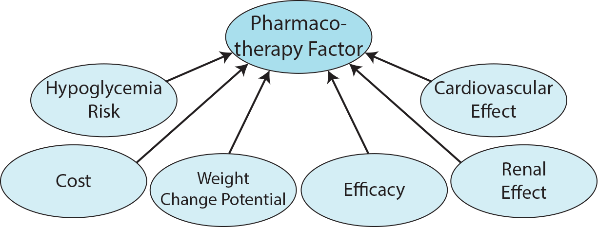
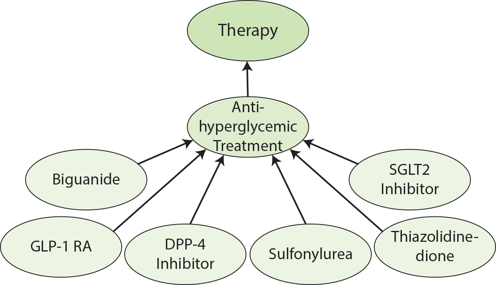

# Overview

The Diabetes Pharmacology Ontology was designed by leveraging the American Diabetes Association 2022 Guidelines Chapter 9 - Pharmacologic Approaches to Glycemic Treatment to represent some common diabetes treatments and several of their characteristics that play a role in therapy planning. Additionally, common symptoms associated with diabetes and lab measurement types were included in the ontology based on NetCE case studies related to diabetes.

# Table of Contents
- [Overview](#overview)
- [Table of Contents](#table-of-contents)
- [Namespaces](#namespaces)
        * [DPO Namespaces](#dpo-namespaces)
- [Diabetes Pharmacology Ontology](#diabetes-pharmacology-ontology)
  * [Factor](#factor)
  * [Pharmacotherapy Factor](#pharmacotherapy-factor)
    + [Efficacy](#efficacy)
      - [High Efficacy](#high-efficacy)
      - [Intermediate Efficacy](#intermediate-efficacy)
      - [Low Efficacy](#low-efficacy)
    + [Weight Change Potential](#weight-change-potential)
      - [Weight Loss Potential](#weight-loss-potential)
      - [Weight Gain Potential](#weight-gain-potential)
      - [Neutral Weight Change](#neutral-weight-change)
    + [Hypoglycemia Risk](#hypoglycemia-risk)
      - [No Known Hypoglycemia Risk](#no-known-hypoglycemia-risk)
      - [Known Hypoglycemia Risk](#known-hypoglycemia-risk)
    + [Cardiovascular Effect](#cardiovascular-effect)
      - [Atherosclerotic Cardiovascular Disease Risk](#atherosclerotic-cardiovascular-disease-risk)
        * [Potential ASCVD Benefit](#potential-ascvd-benefit)
        * [Increased ASCVD Risk](#increased-ascvd-risk)
        * [Neutral ASCVD Risk](#neutral-ascvd-risk)
      - [Heart Failure Risk](#heart-failure-risk)
        * [Potential Heart Failure Benefit](#potential-heart-failure-benefit)
        * [Increased Heart Failure Risk](#increased-heart-failure-risk)
        * [Neutral Heart Failure Risk](#neutral-heart-failure-risk)
    + [Cost](#cost)
      - [Low Cost](#low-cost)
      - [High Cost](#high-cost)
    + [Renal Effect](#renal-effect)
      - [Diabetic Kidney Disease Progression](#diabetic-kidney-disease-progression)
        * [Potential Diabetic Kidney Disease Benefit](#potential-diabetic-kidney-disease-benefit)
        * [Increased Diabetic Kidney Disease Risk](#increased-diabetic-kidney-disease-risk)
        * [Neutral Diabetic Kidney Disease Risk](#neutral-diabetic-kidney-disease-risk)
      - [Renal Dosing Consideration](#renal-dosing-consideration)
  * [Diagnostic Factor](#diagnostic-factor)
    + [Symptom](#symptom)
    + [Condition](#condition)
    + [Disease](#disease)
    + [Behavior and Occupation](#behavior-and-occupation)
    + [History](#history)
  * [Therapy](#therapy)
    + [Biguanide](#biguanide)
      - [Metformin](#metformin)
    + [SGLT2 Inhibitor](#sglt2-inhibitor)
    + [GLP-1 RA](#glp-1-ra)
    + [DPP-4 Inhibitor](#dpp-4-inhibitor)
    + [Thiazolidinedione](#thiazolidinedione)
    + [Sulfonylurea](#sulfonylurea)
  * [Measurement Finding](#measurement-finding)
    + [Weight Related Finding](#weight-related-finding)
      - [Underweight](#underweight)
      - [Normal Weight](#normal-weight)
      - [Overweight](#overweight)
      - [Obese](#obese)
    + [Blood Glucose Related Finding](#blood-glucose-related-finding)
      - [Prediabetes Fasting Blood Glucose Level](#prediabetes-fasting-blood-glucose-level)
      - [Diabetes Fasting Blood Glucose Level](#diabetes-fasting-blood-glucose-level)
      - [Prediabetes Two Hour Blood Glucose Level](#prediabetes-two-hour-blood-glucose-level)
      - [Diabetes Two Hour Blood Glucose Level](#diabetes-two-hour-blood-glucose-level)
      - [Prediabetes HbA1C Level](#prediabetes-hba1c-level)
      - [Diabetes HbA1C Level](#diabetes-hba1c-level)
    + [Cholesterol Related Finding](#cholesterol-related-finding)
      - [Optimal LDL Level](#optimal-ldl-level)
      - [Near Optimal LDL Level](#near-optimal-ldl-level)
      - [Borderline High LDL Level](#borderline-high-ldl-level)
      - [High LDL Level](#high-ldl-level)
      - [Very High LDL Level](#very-high-ldl-level)
    + [Triglyceride Related Finding](#triglyceride-related-finding)
      - [Normal Triglyceride Level](#normal-triglyceride-level)
      - [Borderline High Triglyceride Level](#borderline-high-triglyceride-level)
      - [High Triglyceride Level](#high-triglyceride-level)
      - [Very High Triglyceride Level](#very-high-triglyceride-level)
- [Personal Health Knowledge Graph](#personal-health-knowledge-graph)

# Namespaces

The namespaces used in DPO are listed below.

##### DPO Namespaces

| Prefix | URI |
|:-------------|:------------------|
| dpo | [http://purl.org/twc/DPO/ont/](http://purl.org/twc/dpo/ont/) |
| dpo-kb | [http://purl.org/twc/DPO/kb/](http://purl.org/twc/dpo/kb/) |
| owl | [http://www.w3.org/2002/07/owl#](http://www.w3.org/2002/07/owl#) |
| rdf | [http://www.w3.org/1999/02/22-rdf-syntax-ns#](http://www.w3.org/1999/02/22-rdf-syntax-ns#) |
| rdfs | [http://www.w3.org/2000/01/rdf-schema#](http://www.w3.org/2000/01/rdf-schema#) |
| xsd | [http://www.w3.org/2001/XMLSchema#](http://www.w3.org/2001/XMLSchema#) |
| dct | [http://purl.org/dc/terms/](http://purl.org/dc/terms/) |
| skos | [http://www.w3.org/2004/02/skos/core#](http://www.w3.org/2004/02/skos/core#) |
| ncit | [http://purl.obolibrary.org/obo/NCIT_](http://purl.obolibrary.org/obo/NCIT_) |
| loinc | [http://purl.bioontology.org/ontology/LNC/](http://purl.bioontology.org/ontology/LNC/) |
| chebi | [http://purl.obolibrary.org/obo/CHEBI_](http://purl.obolibrary.org/obo/CHEBI_) |
| efo | [http://www.ebi.ac.uk/efo/EFO_>](http://www.ebi.ac.uk/efo/EFO_>) |
| omit | [http://purl.obolibrary.org/obo/OMIT_](http://purl.obolibrary.org/obo/OMIT_) |
| symp | [http://purl.obolibrary.org/obo/SYMP_](http://purl.obolibrary.org/obo/SYMP_) |
| hp | [http://purl.obolibrary.org/obo/HP_](http://purl.obolibrary.org/obo/HP_) |
| sio | [http://semanticscience.org/resource/](http://semanticscience.org/resource/) |


# Diabetes Pharmacology Ontology

The root branch of the Diabetes Pharmacology Ontology is **dpo:Factor**. All other branches of the ontology extend from this branch.


## Factor
> A factor is a circumstance influencing the treatment or diagnosis of a disease, therapeutic agents that may be administered to produce an effect, or findings resulting from recorded measurements.

Four branches extend from **dpo:Factor**. These are **dpo:PharmacotherapyFactor**, **dpo:DiagnosticFactor**, **dpo:Therapy**, and **dpo:MeasurementFinding**.


## Pharmacotherapy Factor
> A circumstance influencing the treatment of a disease through the use of drugs.

The Pharmacotherapy Factors included in this ontology are based on those included in Chapter 9 of the ADA guidelines. The subclasses of **dpo:PharmacotherapyFactor** include the top level pharmacotherapy factors **dpo:Efficacy**, **dpo:WeightChangePotential**, **dpo:HypoglycemiaRisk**, **dpo:CardiovascularEffect**, **dpo:Cost**, and **dpo:RenalEffect**.



Potential categorizations of these top level pharmacotherapy factors are encoded as subclasses of each respective pharmacotherapy factor. The recommendation of a therapy may be based on whether or not a patient has an attribute that is of type one of the subclasses of the top level pharmacotherapy factors.

### Efficacy
> The capacity to bring about a desired effect. [Definition Source: NCI]

Subclasses of **dpo:Efficacy** include **dpo:HighEfficacy**, **dpo:IntermediateEfficacy**, and **dpo:LowEfficacy**.

#### High Efficacy
> A high capacity to bring about a desired effect.

#### Intermediate Efficacy
> An intermediate capacity to bring about a desired effect.

#### Low Efficacy
> A low capacity to bring about a desired effect.

### Weight Change Potential
> The capacity for an increase or decrease in the weight of an individual.

Subclasses of **dpo:WeightChangePotential** include **dpo:WeightLossPotential**, **dpo:WeightGainPotential**, and **dpo:NeutralWeightChange**.

#### Weight Loss Potential
> The capacity for a decrease in the weight of an individual.

#### Weight Gain Potential
> The capacity for an increase in the weight of an individual.

#### Neutral Weight Change
> The lack of an effect on the capacity for an increase or decrease in the weight of an individual.

### Hypoglycemia Risk
> The possiblility of lowering blood sugar below the normal range.

Subclasses of **dpo:HypoglycemiaRisk** include **dpo:NoKnownHypoglycemiaRisk** and **dpo:KnownHypoglycemiaRisk**.

#### No Known Hypoglycemia Risk
> No known association with the lowering of blood sugar below the normal range.

#### Known Hypoglycemia Risk
> A known association with the lowering of blood sugar below the normal range.

### Cardiovascular Effect
> A pharmacotherapy factor related to the heart or blood vessels.

**dpo:CardiovascularEffect** contains two main subclasses, **dpo:AtheroscleroticCardiovascularDiseaseRisk** and **dpo:HeartFailureRisk**.

#### Atherosclerotic Cardiovascular Disease Risk
> Risk of cardiovascular disease resulting from atherosclerosis.

Subclasses of **dpo:AtheroscleroticCardiovascularDiseaseRisk** include **dpo:PotentialASCVDBenefit**, **dpo:IncreasedASCVDRisk**, and **dpo:NeutralASCVDRisk**.

##### Potential ASCVD Benefit
> Potential to reduce the risk of cardiovascular disease resulting from atherosclerosis.

##### Increased ASCVD Risk
> Potential to increase the risk of cardiovascular disease resulting from atherosclerosis.

##### Neutral ASCVD Risk
> Minimal effect on reducing or increasing the risk of cardiovascular disease resulting from atherosclerosis.

#### Heart Failure Risk
> Risk of heart failure.

Subclasses of **dpo:HeartFailureRisk** include **dpo:PotentialHeartFailureBenefit**, **dpo:IncreasedHeartFailureRisk**, and **dpo:NeutralHeartFailureRisk**.

##### Potential Heart Failure Benefit
> Potential to decrease the risk of heart failure.

##### Increased Heart Failure Risk
> Potential to increase the risk of heart failure.

##### Neutral Heart Failure Risk
> Minimal effect on reducing or increasing the risk of heart failure.

### Cost
> The amount paid, charged, or engaged to be paid, for purchasing goods, services and financial instruments. [Definition Source: NCI]

Subclasses of **dpo:Cost** include **dpo:LowCost** and **dpo:HighCost**.

#### Low Cost
> Relatively inexpensive.

#### High Cost
> Relatively expensive.

### Renal Effect
> A pharmacotherapy factor related to the kidneys.

Subclasses of **dpo:RenalEffect** include **dpo:DiabeticKidneyDiseaseProgression** and **dpo:RenalDosingConsideration**.

#### Diabetic Kidney Disease Progression
> The progression of diabetic kidney disease.

Subclasses of **dpo:DiabeticKidneyDiseaseProgression** include **dpo:PotentialDKDBenefit**, **dpo:IncreasedDKDRisk**, and **dpo:NeutralDKDRisk**.

##### Potential Diabetic Kidney Disease Benefit
> Potential to decrease the risk or progression of diabetic kidney disease.

##### Increased Diabetic Kidney Disease Risk
> Potential to increase the risk or progression of diabetic kidney disease.

##### Neutral Diabetic Kidney Disease Risk
> Minimal effect on reducing or increasing the risk or progression of diabetic kidney disease.

#### Renal Dosing Consideration
> Drug dosage considerations related to the effect on the kidneys.

## Diagnostic Factor
> A circumstance influencing the dianosis of a disease.

Subclasses of **dpo:DiagnosticFactor** include **dpo:Symptom**, **dpo:Condition**, **dpo:Disease**, **dpo:Behavior**, **dpo:Occupation**, and **dpo:History**.


Diagnostic Factors included within the ontology are based on diabetes related NetCE case studies.

### Symptom
> A symptom is a perceived change in function, sensation, loss, disturbance or appearance reported by a patient indicative of a disease. [ url:https://link.springer.com/chapter/10.1007/978-1-4615-4789-1_5 url:https://www.nature.com/subjects/signs-and-symptoms url:https://www.merriam-webster.com/dictionary/symptom ][Definition Source: SYMP:0000462]

Symptoms included in the ontology are based on the symtoms of the example patients in the NetCE diabetes related case studies.

The symtpoms included in the ontology are linked to terms in the Symptoms Ontology using _owl:equivalentClass_.


The top level subclasses of **dpo:Symptom** include **dpo:NutritionMetabolismAndDevelopmentSymptom**, **dpo:UrinarySystemSymptom**, **dpo:VisionSymptom**, **dpo:NeurologicalAndPhysiologicalSymptom**, **dpo:MusculoskeletalSystemSymptom**, and **dpo:NervousSystemSymptom**.

#### Nutrition Metabolism and Development Symptom
> A symptom involving the nutrition, metabolism, and/or development system.

##### Polydipsia
> Polydipsia is a nutrition, metabolism, and development symptom characterized by an excessive or abnormal thirst. [ url:http://www2.merriam-webster.com/cgi-bin/mwmednlm?book=Medical&va=polydipsia ][Definition Source: SYMP:0000560]

##### Polyphagia
> Polyphagia is a nutrition, metabolism, and development symptom characterized by an excessive appetite or eating. [ url:http://www2.merriam-webster.com/cgi-bin/mwmednlm?book=Medical&va=polyphagia ][Definition Source: SYMP:0000524]

#### Urinary System Symptom
> A symptom involving the urinary system.

##### Polyuria
> A urinary system symptom that is characterized by the excessive secretion of urine. [ url:http://www2.merriam-webster.com/cgi-bin/mwmednlm?book=Medical&va=polyuria ][Definition Source: SYMP:0000565]

##### Dysuria
> A urinary system symptom that is characterized by the difficult, or painful, discharge of urine. [ url:http://www2.merriam-webster.com/cgi-bin/mwmednlm?book=Medical&va=dysuria ][Definition Source: SYMP:0000485]

##### Urinary Tract Infection (UTI)
> A bacterial infectious process affecting any part of the urinary tract, most commonly the bladder and the urethra. Symptoms include urinary urgency and frequency, burning sensation during urination, lower abdominal discomfort, and cloudy urine. [Definition Source: NCI]

##### Frequent Urination
> Increased frequency of urination. [Definition Source: HP:0100515]

##### Foul Urine
> 

#### Vision Symptom
> A symptom involving visual impairment.

##### Blurred Vision
> A vision symptom that is characterized by a decreased clarity or sharpness in vision, which can be caused by eye conditions myopia or hyperopia. [Definition Source: SYMP:0000012]

#### Neurological and Physiological Symptom
> 

##### Fatigue
> Fatigue is a neurological and physiological symptom characterized by a weariness or exhaustion from labor, exertion, or stress. [ url:http://www2.merriam-webster.com/cgi-bin/mwmednlm?book=Medical&va=fatigue ][Definition Source: SYMP:0019177]

#### Musculoskeletal System Symptom
> A symptom involving the musculoskeletal system.

##### Arthritis
> Arthritis is a musculoskeletal system symptom characterized as an inflammation of joints due to infectious, metabolic, or constitutional causes. [ url:http://www2.merriam-webster.com/cgi-bin/mwmednlm?book=Medical&va=arthritis ][Definition Source: SYMP:0019169]

##### Peripheral Neuropathy
> 

#### Nervous System Symptom
> 

##### Cerebral Vascular Accident
> A sudden loss of neurological function secondary to hemorrhage or ischemia in the brain parenchyma due to a vascular event. [Definition Source: NCI]
> Stroke is a nervous system symptom characterized by a sudden diminution or loss of consciousness, sensation, and voluntary motion caused by rupture or obstruction (as by a clot) of a blood vessel of the brain. [ url:http://www2.merriam-webster.com/cgi-bin/mwmednlm?book=Medical&va=stroke ][Definition Source: SYMP:0000734]

##### Pain
> A sensation perception where there is an unpleasant sensation that usually indicates the body is threatened or damaged. The sensation may be sharp or dull, short-lived or chronic, intermittent or continual, confined to one area or spread over the entire body. [ url:http://www.nationalpainfoundation.org/MyTreatment/articles/Cancer_PainDefinitions.asp ][Definition Source: SYMP:0000576]

###### Chest Pain
> An unpleasant sensation characterized by physical discomfort (such as pricking, throbbing, or aching) localized to the chest. [Definition Source: HP:0100749]

##### Bilateral Lower Extremity Burning Sensation
> 

### Condition
> A state of being, such as a state of health. [Definition Source: NCI]

Subclasses of **dpo:Condition** include **dpo:Hyperlipidemia** and **dpo:Hypertension**.

#### Hyperlipidemia
> Elevated levels of lipids in the blood. [Definition Source: NCI]

#### Hypertension
> Blood pressure that is abnormally high. [Definition Source: NCI]

### Disease
> Any abnormal condition of the body or mind that causes discomfort, dysfunction, or distress to the person affected or those in contact with the person. The term is often used broadly to include injuries, disabilities, syndromes, symptoms, deviant behaviors, and atypical variations of structure and function. [Definition Source: NCI]

Diseases included in the ontology are those related to the diagnosis or treatment of diabetes based on the considerations of Chapter 9 of the ADA guidelines.

Subclasses of **dpo:Disease** include **dpo:Diabetes**, **dpo:CoronaryArteryDisease**, **dpo:RenalDisease**, and **dpo:CardiovascularDisease**.

#### Coronary Artery Disease
> Narrowing of the coronary arteries due to fatty deposits inside the arterial walls. The diagnostic criteria may include documented history of any of the following: documented coronary artery stenosis greater than or equal to 50% (by cardiac catheterization or other modality of direct imaging of the coronary arteries); previous coronary artery bypass surgery (CABG); previous percutaneous coronary intervention (PCI); previous myocardial infarction. (ACC) [Definition Source: NCI]

#### Diabetes
> 

#### Renal Disease
> Disease associated with kidneys, typically chronic kidney disease.

#### Cardiovascular Disease
> 

### Behavior
> 

Subclasses of **dpo:Behavior** include **dpo:SedentaryLifestyle**, **dpo:AlcoholUse**, and **dpo:DrugUse**.

#### Sedentary Lifestyle
> A type of lifestyle that lacks physical exercise, characterized by sitting, reading, watching television or using a computer for much of the day without vigorous physical exertion. [Definition Source: NCI]

#### Alcohol Use
> 

#### Drug Use
> 

### Occupation
> 

**dpo:Occupation** includes the subclass **dpo:SedentaryOccupation**.

#### Sedentary Occupation
> 

### History
> 

The top level subclasses of **dpo:History** include **dpo:FamilyHistory** and **dpo:PersonalHistory**.

#### Family History
> 

##### Family History of Coronary Artery Disease
> 

##### Family History of Diabetes
> 


#### Personal History
> 

##### Personal History of Gestational Diabetes
> 


##### Personal History of Febrile States
> 


## Therapy
> An action or administration of therapeutic agents to produce an effect that is intended to alter or stop a pathologic process. [Definition Source: NCI]

**dpo:Therapy** contains the subclass **dpo:AntihyperglycemicTreatment** which in turn contains the subclasses **dpo:Biguanide**, **dpo:SGLT2Inhibitor**, **dpo:GLP1RA**, **dpo:DPP4Inhibitor**, **dpo:Sulfonylurea**, and **dpo:Thiazolidinedione**.



The therapies included within this ontology are based on the therapies included in Table 9.2 of the ADA guidelines.

### Biguanide
> Any antidiabetic agent with the biguanide base structure or phenformin derivatives with antihyperglycemic activity. Biguanide antidiabetic agents activate AMP-activated protein kinase (AMPK) resulting in decreased glucose production in the liver, increased peripheral glucose uptake and improved utilization of glucose. Biguanide-based antidiabetic agents do not cause hypoglycemia. In addition, biguanide antidiabetics decrease absorption of glucose from the gastrointestinal tract. [Definition Source: NCI]

For the scope of this work, **dpo:Biguanide** only includes the agent **dpo:Metformin** as a subclass.

#### Metformin
> An agent belonging to the biguanide class of antidiabetics with antihyperglycemic activity. Metformin is associated with a very low incidence of lactic acidosis. This agent helps reduce LDL cholesterol and triglyceride levels, and is not associated with weight gain, and prevents the cardiovascular complications of diabetes. Metformin is not metabolized and is excreted unchanged by the kidneys. [Definition Source: NCI]

```
dpo:Metformin rdfs:subClassOf dpo:Biguanide ;
    owl:equivalentClass omit:0009750 , chebi:6801 , loinc:55548-2, ncit:C61612 ;
    rdfs:label "Metformin"^^xsd:string ;
    rdfs:subClassOf
        [ rdf:type owl:Restriction ;
          owl:onProperty sio:hasAttribute ;
          owl:hasValue [ rdf:type dpo:HighEfficacy ] ] ,
        [ rdf:type owl:Restriction ;
          owl:onProperty sio:hasAttribute ;
          owl:hasValue [ rdf:type dpo:NeutralWeightChange ] ] ,
        [ rdf:type owl:Restriction ;
          owl:onProperty sio:hasAttribute ;
          owl:hasValue [ rdf:type dpo:NoKnownHypoglycemiaRisk ] ] ,
        [ rdf:type owl:Restriction ;
          owl:onProperty sio:hasAttribute ;
          owl:hasValue [ rdf:type dpo:PotentialASCVDBenefit ] ] ,
        [ rdf:type owl:Restriction ;
          owl:onProperty sio:hasAttribute ;
          owl:hasValue [ rdf:type dpo:NeutralHeartFailureRisk ] ] ,
        [ rdf:type owl:Restriction ;
          owl:onProperty sio:hasAttribute ;
          owl:hasValue [ rdf:type dpo:LowCost ] ] ,
        [ rdf:type owl:Restriction ;
          owl:onProperty sio:hasAttribute ;
          owl:hasValue [ rdf:type dpo:NeutralDKDRisk ] ] .
```

### SGLT2 Inhibitor
> Any inhibitor of the sodium-glucose co-transporter subtype 2 (SGLT2) with antihyperglycemic activity. By binding to and blocking SGLT2, these inhibitors suppress reabsorption of glucose in the proximal tubule within the kidneys and thereby enhancing urinary excretion of glucose. This eventually normalizes blood glucose levels. SGLT2, a transport system exclusively expressed in the proximal renal tubules, mediates about 90% of renal glucose reabsorption from tubular fluid. [Definition Source: NCI]

```
dpo:SGLT2Inhibitor rdfs:subClassOf dpo:AntihyperglycemicTreatment ;
    owl:equivalentClass chebi:73273, ncit:C98083 ;
    rdfs:label "SGLT2 Inhibitor"^^xsd:string ;
    rdfs:subClassOf
        [ rdf:type owl:Restriction ;
          owl:onProperty sio:hasAttribute ;
          owl:hasValue [ rdf:type dpo:IntermediateEfficacy ] ] ,
        [ rdf:type owl:Restriction ;
          owl:onProperty sio:hasAttribute ;
          owl:hasValue [ rdf:type dpo:WeightLossPotential ] ] ,
        [ rdf:type owl:Restriction ;
          owl:onProperty sio:hasAttribute ;
          owl:hasValue [ rdf:type dpo:NoKnownHypoglycemiaRisk ] ] ,
        [ rdf:type owl:Restriction ;
          owl:onProperty sio:hasAttribute ;
          owl:hasValue [ rdf:type dpo:HighCost ] ] .
```

### GLP-1 RA
> Any of the analogues of the endogenous gastrointestinal hormone glucagon-like peptide-1 (GLP-1) with antihyperglycemic activity. GLP-1 mimetics mimic the activity of GLP-1 and thereby stimulate glucose-dependent secretion of insulin from pancreatic beta cells, suppress glucagon secretion from alpha cells, increase insulin sensitivity and inhibit gastric emptying thereby slowing absorption of nutrients and creating a satiating effect. Altogether, this lowers blood glucose levels. GLP-1 is rapidly inactivated by the enzyme dipeptidyl peptidase-4 (DPP-4). [Definition Source: NCI]
> An agonist that binds to and activates glucagon-like peptide-1 (GLP-1) receptors. [Definition Source: CHEBI]

```
dpo:GLP1RA rdfs:subClassOf dpo:AntihyperglycemicTreatment ;
    owl:equivalentClass chebi:71196 , ncit:C98085 ;
    rdfs:label "GLP-1 RA" ;
    skos:definition ""^^xsd:string ;
    rdfs:subClassOf
        [ rdf:type owl:Restriction ;
          owl:onProperty sio:hasAttribute ;
          owl:hasValue [ rdf:type dpo:HighEfficacy ] ] ,
        [ rdf:type owl:Restriction ;
          owl:onProperty sio:hasAttribute ;
          owl:hasValue [ rdf:type dpo:WeightLossPotential ] ] ,
        [ rdf:type owl:Restriction ;
          owl:onProperty sio:hasAttribute ;
          owl:hasValue [ rdf:type dpo:NoKnownHypoglycemiaRisk ] ] ,
        [ rdf:type owl:Restriction ;
          owl:onProperty sio:hasAttribute ;
          owl:hasValue [ rdf:type dpo:NeutralHeartFailureRisk ] ] ,
        [ rdf:type owl:Restriction ;
          owl:onProperty sio:hasAttribute ;
          owl:hasValue [ rdf:type dpo:HighCost ] ] .
```

### DPP-4 Inhibitor
> Any inhibitor of the proline-specific serine protease dipeptidyl peptidase 4 (DPP-4), with hypoglycemic activity. DPP-4 inhibitors bind to DPP-4 and inhibit the breakdown of the incretin hormones glucagon-like peptide-1 (GLP-1) and glucose-dependent insulinotropic polypeptide (GIP). This prolongs incretin activity, increases postprandial insulin release, decreases glucagon release, delays gastric emptying and lowers blood glucose levels. The risk for hypoglycemia is negligible with the use of DPP-4 inhibitors. [Definition Source: NCI]
> An EC 3.4.14.* (dipeptidyl- and tripeptidyl-peptidases) inhibitor that specifically inhibits dipeptidyl peptidase-4 (EC 3.4.14.5). [Definition Source: CHEBI]

```
dpo:DPP4Inhibitor rdfs:subClassOf dpo:AntihyperglycemicTreatment ;
    owl:equivalentClass chebi:68612 , ncit:C98086 ;
    rdfs:label "DPP-4 Inhibitor"^^xsd:string ;
    rdfs:subClassOf
        [ rdf:type owl:Restriction ;
          owl:onProperty sio:hasAttribute ;
          owl:hasValue [ rdf:type dpo:IntermediateEfficacy ] ] ,
        [ rdf:type owl:Restriction ;
          owl:onProperty sio:hasAttribute ;
          owl:hasValue [ rdf:type dpo:NeutralWeightChange ] ] ,
        [ rdf:type owl:Restriction ;
          owl:onProperty sio:hasAttribute ;
          owl:hasValue [ rdf:type dpo:NoKnownHypoglycemiaRisk ] ] ,
        [ rdf:type owl:Restriction ;
          owl:onProperty sio:hasAttribute ;
          owl:hasValue [ rdf:type dpo:NeutralASCVDRisk ] ] ,
        [ rdf:type owl:Restriction ;
          owl:onProperty sio:hasAttribute ;
          owl:hasValue [ rdf:type dpo:HighCost ] ] ,
        [ rdf:type owl:Restriction ;
          owl:onProperty sio:hasAttribute ;
          owl:hasValue [ rdf:type dpo:NeutralDKDRisk ] ] .
```

### Thiazolidinedione
> Any antidiabetic agent with the glitazone (thiazolidinedione) base structure with antihyperglycemic activity. Glitazone antidiabetic agents selectively bind to and stimulate the nuclear receptor peroxisome proliferator-activated receptor (PPAR) gamma. This results in the selective transcription of a number of insulin-sensitive genes involved in glucose metabolism. This eventually enhances insulin sensitivity, reduces insulin resistance and decreases hepatic gluconeogenesis. PPARs function as transcription factors that regulate expressions of genes involved in cellular differentiation, development, and metabolism (carbohydrate, lipid, protein), as well as tumorigenesis; PPARgamma is expressed at high levels in adipose tissue. [Definition Source: NCI]

```
dpo:Thiazolidinedione rdfs:subClassOf dpo:AntihyperglycemicTreatment ;
    owl:equivalentClass chebi:50990 , ncit:C98241 ;
    rdfs:label "Thiazolidinedione"^^xsd:string ;
    rdfs:subClassOf
        [ rdf:type owl:Restriction ;
          owl:onProperty sio:hasAttribute ;
          owl:hasValue [ rdf:type dpo:HighEfficacy ] ] ,
        [ rdf:type owl:Restriction ;
          owl:onProperty sio:hasAttribute ;
          owl:hasValue [ rdf:type dpo:WeightGainPotential ] ] ,
        [ rdf:type owl:Restriction ;
          owl:onProperty sio:hasAttribute ;
          owl:hasValue [ rdf:type dpo:NoKnownHypoglycemiaRisk ] ] ,
        [ rdf:type owl:Restriction ;
          owl:onProperty sio:hasAttribute ;
          owl:hasValue [ rdf:type dpo:IncreasedHeartFailureRisk ] ] ,
        [ rdf:type owl:Restriction ;
          owl:onProperty sio:hasAttribute ;
          owl:hasValue [ rdf:type dpo:LowCost ] ] ,
        [ rdf:type owl:Restriction ;
          owl:onProperty sio:hasAttribute ;
          owl:hasValue [ rdf:type dpo:NeutralDKDRisk ] ] .
```

### Sulfonylurea
> Sulfonamide urea derivatives with antihyperglycemic activity. Sulphonylurea antidiabetic agents bind to sulfonylurea receptor type 1 (SUR1), the subunit of ATP-sensitive inwardly-rectifier potassium (IKATP) channels on the membranes of pancreatic beta cells, thereby blocking the inward current flow (influx) of positively charged K+ ions into the cell. This results in tonic membrane depolarization, and induces a calcium ion influx through voltage-sensitive calcium channels; increased intracellular calcium ion levels trigger exocytosis of insulin-containing granules. This eventually induces secretion of insulin. The IKATP channels found in pancreatic islets are complexes of four IKATP 6.2 and four SUR1 subunits. In addition, some sulfonylureas of larger molecular size may increase the sensitivity of peripheral tissues to insulin mediated through peroxisome proliferator-activated receptor gamma (PPARgamma). [Definition Source: NCI]

```
dpo:Sulfonylurea rdfs:subClassOf dpo:AntihyperglycemicTreatment ;
    owl:equivalentClass chebi:76983 , ncit:C97936 ;
    rdfs:label "Sulfonylurea"^^xsd:string ;
    rdfs:subClassOf
        [ rdf:type owl:Restriction ;
          owl:onProperty sio:hasAttribute ;
          owl:hasValue [ rdf:type dpo:HighEfficacy ] ] ,
        [ rdf:type owl:Restriction ;
          owl:onProperty sio:hasAttribute ;
          owl:hasValue [ rdf:type dpo:WeightGainPotential ] ] ,
        [ rdf:type owl:Restriction ;
          owl:onProperty sio:hasAttribute ;
          owl:hasValue [ rdf:type dpo:KnownHypoglycemiaRisk ] ] ,
        [ rdf:type owl:Restriction ;
          owl:onProperty sio:hasAttribute ;
          owl:hasValue [ rdf:type dpo:NeutralASCVDRisk ] ] ,
        [ rdf:type owl:Restriction ;
          owl:onProperty sio:hasAttribute ;
          owl:hasValue [ rdf:type dpo:NeutralHeartFailureRisk ] ] ,
        [ rdf:type owl:Restriction ;
          owl:onProperty sio:hasAttribute ;
          owl:hasValue [ rdf:type dpo:LowCost ] ] ,
        [ rdf:type owl:Restriction ;
          owl:onProperty sio:hasAttribute ;
          owl:hasValue [ rdf:type dpo:NeutralDKDRisk ] ] .
```

## Measurement Finding
> A finding surmised from recorded measurements.

The measurement finding branch contains categorizations that can be made based on lab measurements. Subclasses of **dpo:MeasurementFinding** include **dpo:WeightRelatedFinding**, **dpo:BloodGlucoseRelatedFinding**, **dpo:CholesterolRelatedFinding**, and **dpo:TriglycerideRelatedFinding**.


The measurement finding categorizations included in the ontology are based on measurement values found in the diabetes related NetCE case studies.

### Weight Related Finding

Subclasses of **dpo:WeightRelatedFinding** include **dpo:Underweight**, **dpo:NormalWeight**, **dpo:Overweight** and **dpo:Obese**.


The categorization of the weight related findings and the associated BMI ranges are based on the Centers for Disease Control and Prevention interpretation of BMI for adults.

#### Underweight
> The quantification of weight/height relationships below a certain threshold that classes an individual as underweight. This threshold may vary based on an individual's ethnicity but is commonly considered in European populations to correspond to a BMI < 18. [Definition Source: EFO:0005936]

```
dpo:Underweight rdf:type owl:Class ; 
    rdfs:subClassOf dpo:WeightRelatedFinding ;
    owl:intersectionOf
            ( ncit:C138901 
              [ rdf:type owl:Restriction ;
                owl:onProperty sio:hasValue ;
                owl:allValuesFrom dpo:UnderweightBMIRange ] ) ;
    rdfs:label "Underweight"^^xsd:string ;
    rdfs:comment "BMI<18.5"^^xsd:string .

dpo:UnderweightBMIRange rdf:type owl:DataRange ;
    rdfs:label "Underweight BMI Range" ;
    owl:onDataRange xsd:decimal ;
    owl:maxInclusive "18.5"^^xsd:decimal .
```

#### Normal Weight

```
dpo:NormalWeight rdf:type owl:Class ; 
    rdfs:subClassOf dpo:WeightRelatedFinding ;
    owl:intersectionOf
            ( ncit:C138901 
              [ rdf:type owl:Restriction ;
                owl:onProperty sio:hasValue ;
                owl:allValuesFrom dpo:NormalWeightBMIRange ] ) ;
    rdfs:label "Normal Weight"^^xsd:string ;
    rdfs:comment "18.5<BMI<24.9"^^xsd:string .

dpo:NormalWeightBMIRange rdf:type owl:DataRange ;
    rdfs:label "Normal Weight BMI Range" ;
    owl:onDataRange xsd:decimal ;
    owl:minInclusive "18.5"^^xsd:decimal ;
    owl:maxInclusive "24.9"^^xsd:decimal .
```


#### Overweight
> The quantification of weight/height relationships above a certain threshold that classes an individual as overweight. This threshold may vary based on an individual's ethnicity but is commonly considered to correspond in European populations to a 25<BMI<30. [Definition Source: EFO:0005935]

```
dpo:Overweight rdf:type owl:Class ; 
    rdfs:subClassOf dpo:WeightRelatedFinding ;
    owl:intersectionOf
            ( ncit:C138901 
              [ rdf:type owl:Restriction ;
                owl:onProperty sio:hasValue ;
                owl:allValuesFrom dpo:OverweightBMIRange ] ) ;
    rdfs:label "Overweight"^^xsd:string ;
    rdfs:comment "25<BMI<29.9"^^xsd:string .

dpo:OverweightBMIRange rdf:type owl:DataRange ;
    rdfs:label "Overweight BMI Range" ;
    owl:onDataRange xsd:decimal ;
    owl:minInclusive "25"^^xsd:decimal ;
    owl:maxInclusive "29.9"^^xsd:decimal .
```


#### Obese
> Having a high amount of body fat (body mass index [BMI] of 30 or more). [Definition Source: NCI]
> The quantification of weight/height relationships above a certain threshold that classes an individual as overweight. This threshold may vary based on an individual's ethnicity but is commonly considered to correspond in European populations to a BMI > 30. [Definition Source: EBI:0007041]

```
dpo:Obese rdf:type owl:Class ; # diabetes symptom
    rdfs:subClassOf dpo:WeightRelatedFinding ;
    owl:intersectionOf
            ( ncit:C138901 
              [ rdf:type owl:Restriction ;
                owl:onProperty sio:hasValue ;
                owl:allValuesFrom dpo:ObeseBMIRange ] ) ;
    owl:equivalentClass symp:0020018 , ncit:C3283;
    rdfs:label "Obese"^^xsd:string ;
    rdfs:comment "30<BMI"^^xsd:string .

dpo:ObeseBMIRange rdf:type owl:DataRange ;
    rdfs:label "Obese BMI Range" ;
    owl:onDataRange xsd:decimal ;
    owl:minInclusive "30"^^xsd:decimal .
```

### Blood Glucose Related Finding

Subclasses of **dpo:BloodGlucoseRelatedFinding** include **dpo:PrediabetesFastingBloodGlucoseLevel**, **dpo:DiabetesFastingBloodGlucoseLevel**, **dpo:PrediabetesTwoHourBloodGlucoseLevel**, **dpo:DiabetesTwoHourBloodGlucoseLevel**, **dpo:PrediabetesHbA1CLevel** and **dpo:DiabetesHbA1CLevel**.


#### Prediabetes Fasting Blood Glucose Level

```
dpo:PrediabetesFastingBloodGlucoseLevel rdf:type owl:Class ;
    rdfs:subClassOf dpo:BloodGlucoseRelatedFinding ;
    owl:intersectionOf
            ( loinc:1558-6 
              [ rdf:type owl:Restriction ;
                owl:onProperty sio:hasValue ;
                owl:allValuesFrom dpo:PrediabetesFastingBloodGlucoseRange ] ) ;
    rdfs:label "Prediabetes Fasting Blood Glucose Level"^^xsd:string .

dpo:PrediabetesFastingBloodGlucoseRange rdf:type owl:DataRange ;
    rdfs:label "Prediabetes Fasting Blood Glucose Range" ;
    owl:onDataRange xsd:decimal ;
    owl:minInclusive "100"^^xsd:decimal ;
    owl:maxInclusive "125"^^xsd:decimal .
```

#### Diabetes Fasting Blood Glucose Level

```
dpo:DiabetesFastingBloodGlucoseLevel rdf:type owl:Class ;
    rdfs:subClassOf dpo:BloodGlucoseRelatedFinding ;
    owl:intersectionOf
            ( loinc:1558-6 
              [ rdf:type owl:Restriction ;
                owl:onProperty sio:hasValue ;
                owl:allValuesFrom dpo:DiabetesFastingBloodGlucoseRange ] ) ;
    rdfs:label "Diabetes Fasting Blood Glucose Level"^^xsd:string .

dpo:DiabetesFastingBloodGlucoseRange rdf:type owl:DataRange ;
    rdfs:label "Diabetes Fasting Blood Glucose Range" ;
    owl:onDataRange xsd:decimal ;
    owl:minInclusive "126"^^xsd:decimal .
```

#### Prediabetes Two Hour Blood Glucose Level

```
dpo:PrediabetesTwoHourBloodGlucoseLevel rdf:type owl:Class ;
    rdfs:subClassOf dpo:BloodGlucoseRelatedFinding ;
    owl:intersectionOf
            ( loinc:1518-0 
              [ rdf:type owl:Restriction ;
                owl:onProperty sio:hasValue ;
                owl:allValuesFrom dpo:PrediabetesTwoHourBloodGlucoseRange ] ) ;
    rdfs:label "Prediabetes Two Hour Blood Glucose Level"^^xsd:string .

dpo:PrediabetesTwoHourBloodGlucoseRange rdf:type owl:DataRange ;
    rdfs:label "Prediabetes Two Hour Blood Glucose Range" ;
    owl:onDataRange xsd:decimal ;
    owl:minInclusive "140"^^xsd:decimal ;
    owl:maxInclusive "199"^^xsd:decimal .
```

#### Diabetes Two Hour Blood Glucose Level

```
dpo:DiabetesTwoHourBloodGlucoseLevel rdf:type owl:Class ;
    rdfs:subClassOf dpo:BloodGlucoseRelatedFinding ;
    owl:intersectionOf
            ( loinc:1518-0 
              [ rdf:type owl:Restriction ;
                owl:onProperty sio:hasValue ;
                owl:allValuesFrom dpo:DiabetesTwoHourBloodGlucoseRange ] ) ;
    rdfs:label "Diabetes Two Hour Blood Glucose Level"^^xsd:string .

dpo:DiabetesTwoHourBloodGlucoseRange rdf:type owl:DataRange ;
    rdfs:label "Diabetes Two Hour Blood Glucose Range" ;
    owl:onDataRange xsd:decimal ;
    owl:minInclusive "200"^^xsd:decimal .
```

#### Prediabetes HbA1C Level

```
dpo:PrediabetesHbA1CLevel rdf:type owl:Class ;
    rdfs:subClassOf dpo:BloodGlucoseRelatedFinding ;
    owl:intersectionOf
            ( loinc:59261-8 
              [ rdf:type owl:Restriction ;
                owl:onProperty sio:hasValue ;
                owl:allValuesFrom dpo:PrediabetesHbA1CRange ] ) ;
    rdfs:label "Prediabetes HbA1C Level"^^xsd:string .

dpo:PrediabetesHbA1CRange rdf:type owl:DataRange ;
    rdfs:label "Prediabetes HbA1C Range" ;
    owl:onDataRange xsd:decimal ;
    owl:minInclusive "117"^^xsd:decimal ;
    owl:maxInclusive "138"^^xsd:decimal .

```

#### Diabetes HbA1C Level

```
dpo:DiabetesHbA1CLevel rdf:type owl:Class ;
    rdfs:subClassOf dpo:BloodGlucoseRelatedFinding ;
    owl:intersectionOf
            ( loinc:59261-8
              [ rdf:type owl:Restriction ;
                owl:onProperty sio:hasValue ;
                owl:allValuesFrom dpo:DiabetesHbA1CRange ] ) ;
    rdfs:label "Diabetes HbA1C Level"^^xsd:string .

dpo:DiabetesHbA1CRange rdf:type owl:DataRange ;
    rdfs:label "Prediabetes HbA1C Range" ;
    owl:onDataRange xsd:decimal ;
    owl:minInclusive "141"^^xsd:decimal .
```

### Cholesterol Related Finding

Subclasses of **dpo:CholesterolRelatedFinding** include **dpo:OptimalLDLLevel**, **dpo:NearOptimalLDLLevel**, **dpo:BorderlineHighLDLLevel**, **dpo:HighLDLLevel**, and **dpo:VeryHighLDLLevel**.


#### Optimal LDL Level

```
dpo:OptimalLDLLevel rdf:type owl:Class ;
    rdfs:subClassOf dpo:CholesterolRelatedFinding ;
    owl:intersectionOf
            ( loinc:2089-1
              [ rdf:type owl:Restriction ;
                owl:onProperty sio:hasValue ;
                owl:allValuesFrom dpo:OptimalLDLRange ] ) ;
    rdfs:label "Optimal LDL Level"^^xsd:string .

dpo:OptimalLDLRange rdf:type owl:DataRange ;
    rdfs:label "Optimal LDL Range" ;
    owl:onDataRange xsd:decimal ;
    owl:maxInclusive "100"^^xsd:decimal .
```

#### Near Optimal LDL Level

```
dpo:NearOptimalLDLLevel rdf:type owl:Class ;
    rdfs:subClassOf dpo:CholesterolRelatedFinding ;
    owl:intersectionOf
            ( loinc:2089-1
              [ rdf:type owl:Restriction ;
                owl:onProperty sio:hasValue ;
                owl:allValuesFrom dpo:NearOptimalLDLRange ] ) ;
    rdfs:label "Near Optimal LDL Level"^^xsd:string .

dpo:NearOptimalLDLRange rdf:type owl:DataRange ;
    rdfs:label "Near Optimal LDL Range" ;
    owl:onDataRange xsd:decimal ;
    owl:minInclusive "100"^^xsd:decimal ;
    owl:maxInclusive "129"^^xsd:decimal .
```

#### Borderline High LDL Level

```
dpo:BorderlineHighLDLLevel rdf:type owl:Class ;
    rdfs:subClassOf dpo:CholesterolRelatedFinding ;
    owl:intersectionOf
            ( loinc:2089-1
              [ rdf:type owl:Restriction ;
                owl:onProperty sio:hasValue ;
                owl:allValuesFrom dpo:BorderlineHighLDLRange ] ) ;
    rdfs:label "Borderline High LDL Level"^^xsd:string .

dpo:BorderlineHighLDLRange rdf:type owl:DataRange ;
    rdfs:label "Borderline High LDL Range" ;
    owl:onDataRange xsd:decimal ;
    owl:minInclusive "130"^^xsd:decimal ;
    owl:maxInclusive "159"^^xsd:decimal .
```

#### High LDL Level

```
dpo:HighLDLLevel rdf:type owl:Class ;
    rdfs:subClassOf dpo:CholesterolRelatedFinding ;
    owl:intersectionOf
            ( loinc:2089-1
              [ rdf:type owl:Restriction ;
                owl:onProperty sio:hasValue ;
                owl:allValuesFrom dpo:HighLDLRange ] ) ;
    rdfs:label "High LDL Level"^^xsd:string .

dpo:HighLDLRange rdf:type owl:DataRange ;
    rdfs:label "High LDL Range" ;
    owl:onDataRange xsd:decimal ;
    owl:minInclusive "160"^^xsd:decimal ;
    owl:maxInclusive "189"^^xsd:decimal .
```

#### Very High LDL Level

```
dpo:VeryHighLDLLevel rdf:type owl:Class ;
    rdfs:subClassOf dpo:CholesterolRelatedFinding ;
    owl:intersectionOf
            ( loinc:2089-1
              [ rdf:type owl:Restriction ;
                owl:onProperty sio:hasValue ;
                owl:allValuesFrom dpo:VeryHighLDLRange ] ) ;
    rdfs:label "Very High LDL Level"^^xsd:string .

dpo:VeryHighLDLRange rdf:type owl:DataRange ;
    rdfs:label "Very High LDL Range" ;
    owl:onDataRange xsd:decimal ;
    owl:minInclusive "190"^^xsd:decimal .
```

### Triglyceride Related Finding

Subclasses of **dpo:TriglycerideRelatedFinding** include **dpo:NormalTriglycerideLevel**, **dpo:BorderlineHighTriglycerideLevel**, **dpo:HighTriglycerideLevel** and **dpo:VeryHighTriglycerideLevel**.


#### Normal Triglyceride Level

```
dpo:NormalTriglycerideLevel rdf:type owl:Class ;
    rdfs:subClassOf dpo:TriglycerideRelatedFinding ;
    owl:intersectionOf
            ( loinc:12228-3
              [ rdf:type owl:Restriction ;
                owl:onProperty sio:hasValue ;
                owl:allValuesFrom dpo:NormalTriglycerideRange ] ) ;
    rdfs:label "Normal Triglyceride Level"^^xsd:string .

dpo:NormalTriglycerideRange rdf:type owl:DataRange ;
    rdfs:label "Normal Triglyceride Range" ;
    owl:onDataRange xsd:decimal ;
    owl:maxInclusive "149"^^xsd:decimal .
```

#### Borderline High Triglyceride Level

```
dpo:BorderlineHighTriglycerideLevel rdf:type owl:Class ;
    rdfs:subClassOf dpo:TriglycerideRelatedFinding ;
    owl:intersectionOf
            ( loinc:12228-3
              [ rdf:type owl:Restriction ;
                owl:onProperty sio:hasValue ;
                owl:allValuesFrom dpo:BorderlineHighTriglycerideRange ] ) ;
    rdfs:label "Borderline High Triglyceride Level"^^xsd:string .

dpo:BorderlineHighTriglycerideRange rdf:type owl:DataRange ;
    rdfs:label "Borderline High Triglyceride Range" ;
    owl:onDataRange xsd:decimal ;
    owl:minInclusive "150"^^xsd:decimal ;
    owl:maxInclusive "199"^^xsd:decimal .
```

#### High Triglyceride Level

```
dpo:HighTriglycerideLevel rdf:type owl:Class ;
    rdfs:subClassOf dpo:TriglycerideRelatedFinding ;
    owl:intersectionOf
            ( loinc:12228-3
              [ rdf:type owl:Restriction ;
                owl:onProperty sio:hasValue ;
                owl:allValuesFrom dpo:HighTriglycerideRange ] ) ;
    rdfs:label "High Triglyceride Level"^^xsd:string .

dpo:HighTriglycerideRange rdf:type owl:DataRange ;
    rdfs:label "High Triglyceride Range" ;
    owl:onDataRange xsd:decimal ;
    owl:minInclusive "200"^^xsd:decimal ;
    owl:maxInclusive "499"^^xsd:decimal .
```

#### Very High Triglyceride Level

```
dpo:VeryHighTriglycerideLevel rdf:type owl:Class ;
    rdfs:subClassOf dpo:TriglycerideRelatedFinding ;
    owl:intersectionOf
            ( loinc:12228-3
              [ rdf:type owl:Restriction ;
                owl:onProperty sio:hasValue ;
                owl:allValuesFrom dpo:VeryHighTriglycerideRange ] ) ;
    rdfs:label "Very High Triglyceride Level"^^xsd:string .

dpo:VeryHighTriglycerideRange rdf:type owl:DataRange ;
    rdfs:label "Very High Triglyceride Range" ;
    owl:onDataRange xsd:decimal ;
    owl:minInclusive "500"^^xsd:decimal .
```

# Personal Health Knowledge Graph
